# Payverge

[](https://github.com/stdevMac/payverge/actions/workflows/ci.yml)
[](https://github.com/stdevMac/payverge/actions/workflows/codeql.yml)

Payverge is a self-hostable restaurant system with AI built into real
operations. Guests scan a QR code, order, split the bill and pay. Staff run
the floor, the kitchen display, reservations and delivery. Owners get an AI
waiter for guests, an ops assistant for the shift and a director console that
proposes changes they preview and apply. Payments go through Stripe, PayPal,
MercadoPago or USDC on-chain, and Argentine venues can issue ARCA (AFIP)
fiscal receipts.

It is a Go/Gin + PostgreSQL 18 backend and a Next.js 15 frontend, shipped as
Docker images with a one-command installer.

## Screenshots

Captured from a local [`--demo` install](#local-trial). The venues and their
data are fictional. The AI screens show what an install with no model key
shows. The staff AI screens are stamped to say no model is connected; the
guest helper says so itself. How these were made and how to
recapture them: [docs/assets/screenshots/README.md](docs/assets/screenshots/README.md).

<table>
<tr>
<td width="50%" valign="top"><a href="docs/assets/screenshots/storefront-desktop.png">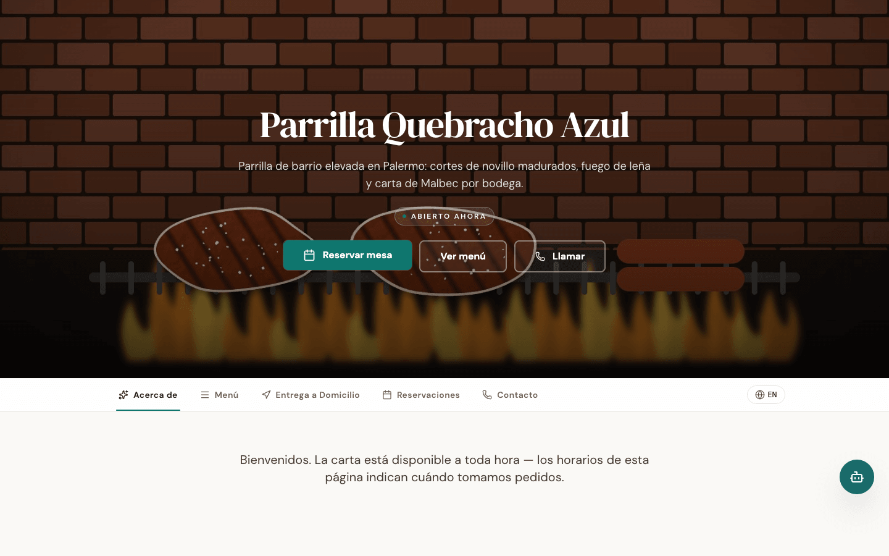</a><br><sub><b>Storefront.</b> <code>/</code> is the venue page when one venue is primary.</sub></td>
<td width="50%" valign="top"><a href="docs/assets/screenshots/dashboard-overview.png">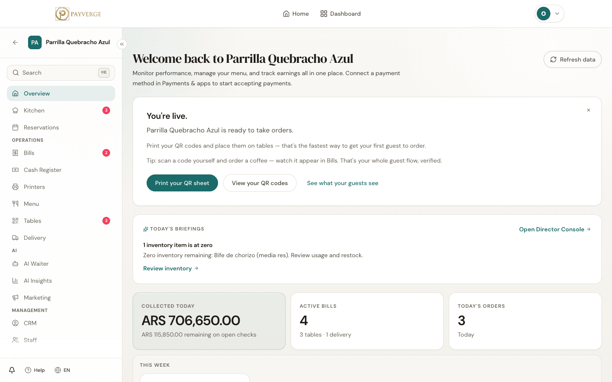</a><br><sub><b>Owner dashboard.</b> Takings, open bills and the day's briefing.</sub></td>
</tr>
</table>

Guest, on a phone:

<table>
<tr>
<td width="20%" valign="top"><a href="docs/assets/screenshots/guest-menu.png">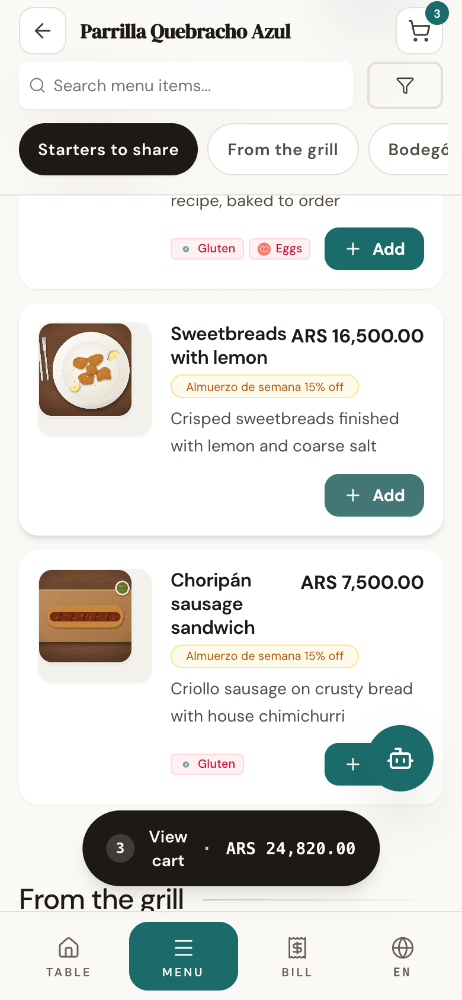</a><br><sub><b>QR menu.</b> Allergens, offers and the cart.</sub></td>
<td width="20%" valign="top"><a href="docs/assets/screenshots/guest-cart.png">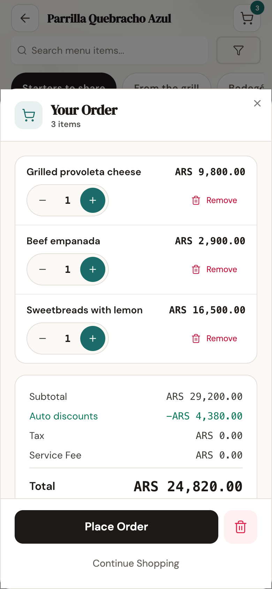</a><br><sub><b>Cart.</b> Discounts apply before the order is sent.</sub></td>
<td width="20%" valign="top"><a href="docs/assets/screenshots/guest-bill-split.png">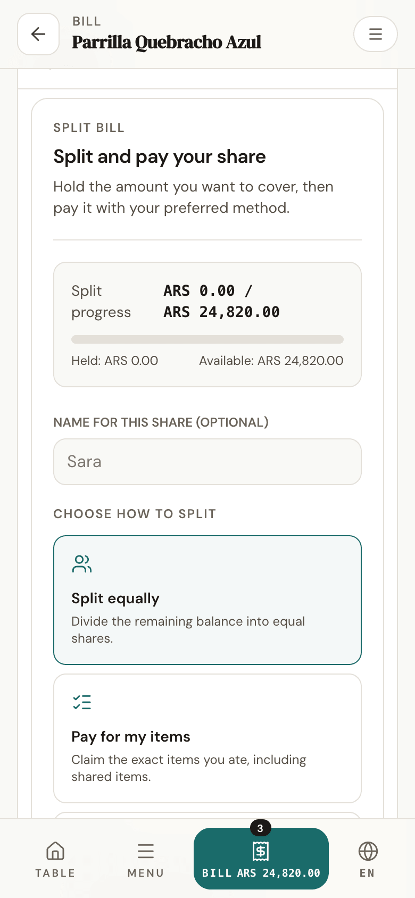</a><br><sub><b>Split the bill.</b> Equal shares, by item, or a custom amount.</sub></td>
<td width="20%" valign="top"><a href="docs/assets/screenshots/guest-payment.png">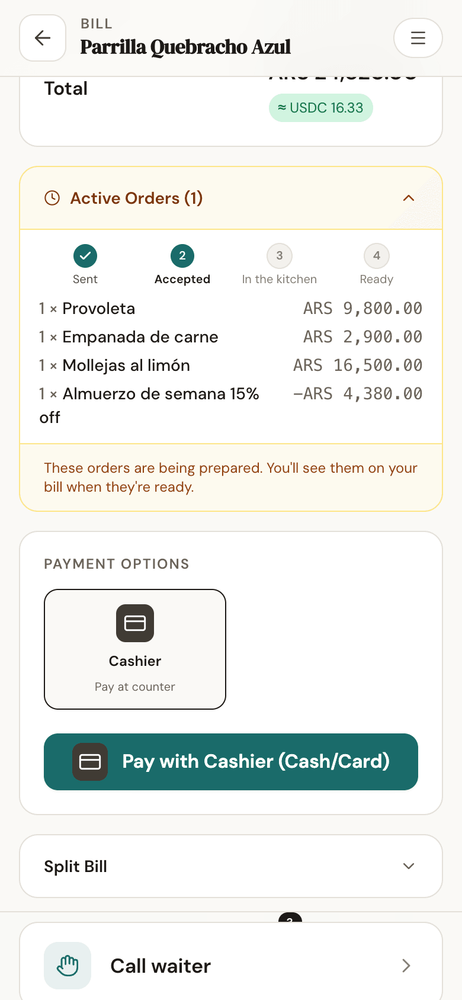</a><br><sub><b>Payment choice.</b> Pay at the counter works with no processor connected.</sub></td>
<td width="20%" valign="top"><a href="docs/assets/screenshots/guest-receipt.png">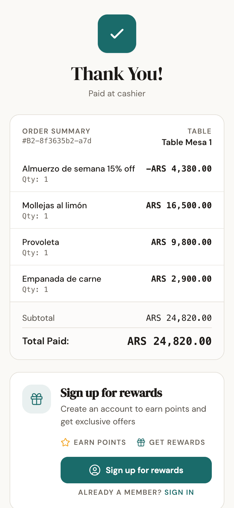</a><br><sub><b>Receipt.</b> Shown as soon as staff record the payment.</sub></td>
</tr>
</table>

Staff and owner:

<table>
<tr>
<td width="33%" valign="top"><a href="docs/assets/screenshots/kitchen.png">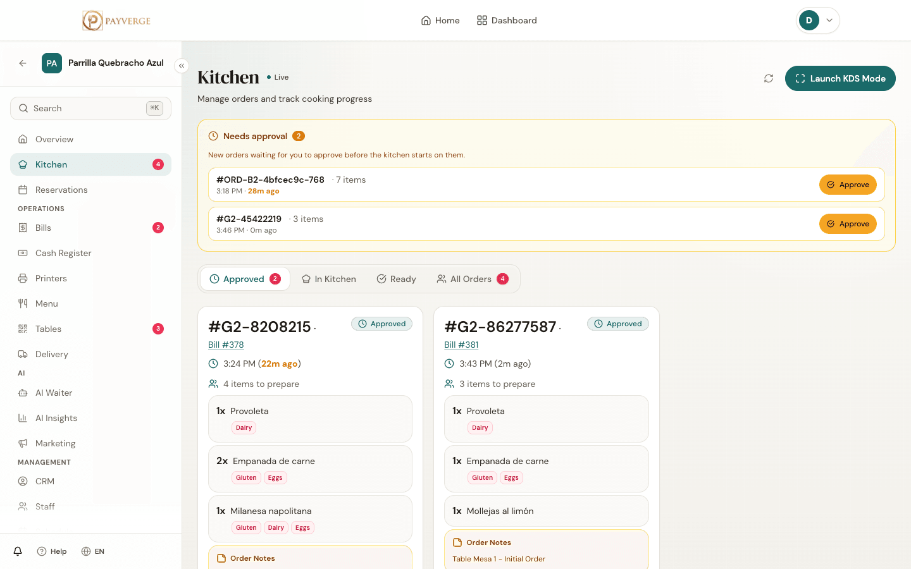</a><br><sub><b>Kitchen.</b> Approve guest tickets, then cook.</sub></td>
<td width="33%" valign="top"><a href="docs/assets/screenshots/tables.png">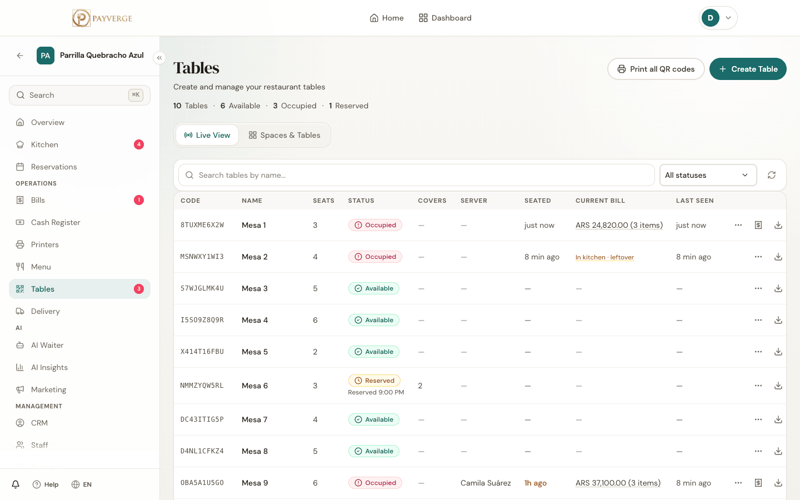</a><br><sub><b>Floor and tables.</b> Live status and open bills.</sub></td>
<td width="33%" valign="top"><a href="docs/assets/screenshots/menu-editor.png">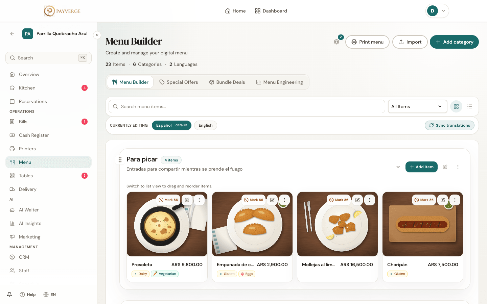</a><br><sub><b>Menu editor.</b> Two languages, allergens, offers.</sub></td>
</tr>
<tr>
<td width="33%" valign="top"><a href="docs/assets/screenshots/reservations.png">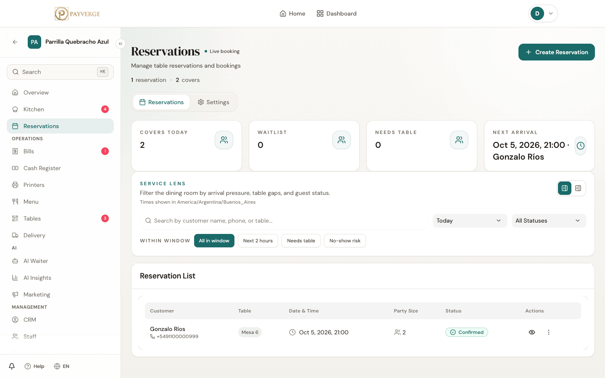</a><br><sub><b>Reservations.</b> Covers, waitlist and arrivals.</sub></td>
<td width="33%" valign="top"><a href="docs/assets/screenshots/delivery.png">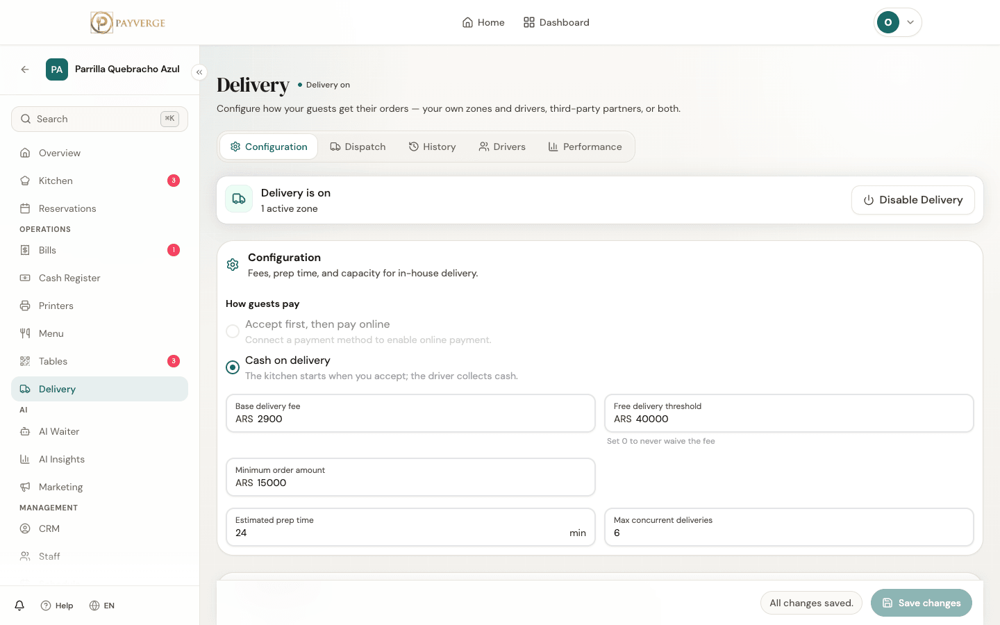</a><br><sub><b>Delivery.</b> Own zones and drivers.</sub></td>
<td width="33%" valign="top"><a href="docs/assets/screenshots/admin.png">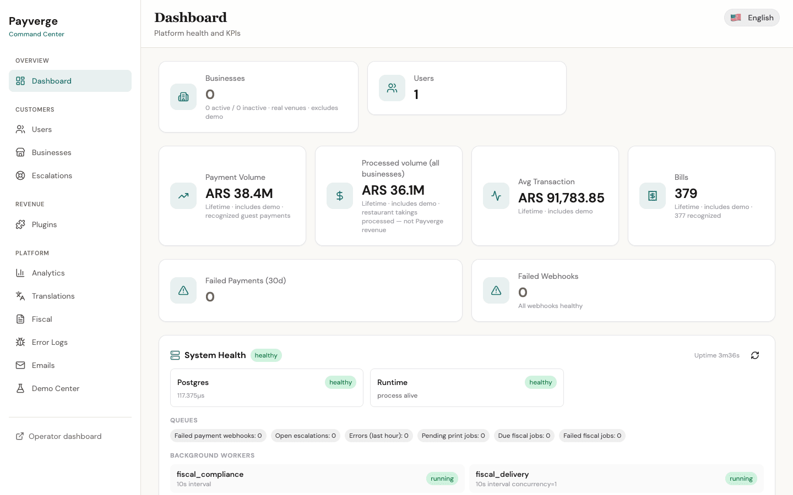</a><br><sub><b>Admin.</b> Platform health, queues and workers.</sub></td>
</tr>
</table>

AI, on an install without a model key:

<table>
<tr>
<td width="33%" valign="top"><a href="docs/assets/screenshots/ai-waiter-guest.png">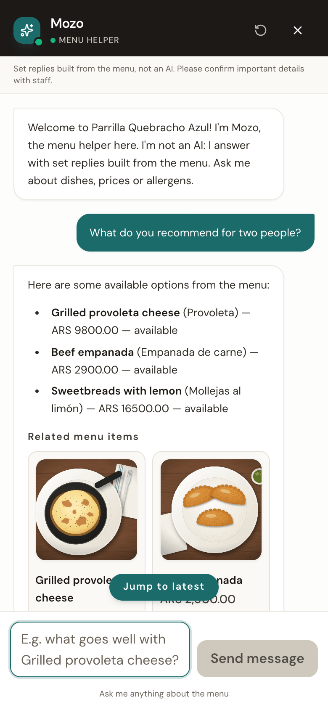</a><br><sub><b>AI waiter, no model key.</b> It becomes a menu helper that says it is not an AI.</sub></td>
<td width="33%" valign="top"><a href="docs/assets/screenshots/ai-waiter-dashboard.png">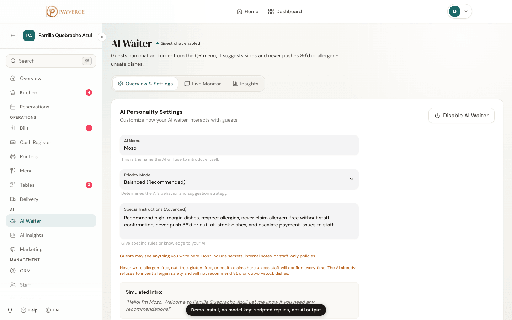</a><br><sub><b>AI waiter settings.</b> Name, tone and guardrails.</sub></td>
<td width="33%" valign="top"><a href="docs/assets/screenshots/director-console.png">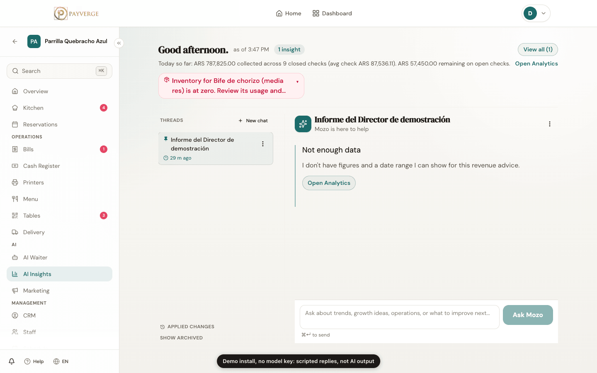</a><br><sub><b>Director console, no model key.</b> It says what data it lacks instead of making up an answer.</sub></td>
</tr>
</table>

To click through it yourself, use the **[live demo](https://demo.payverge.io/)**:
enter a seeded restaurant as the owner, as kitchen or waiter staff, or as a
guest at a table, no sign-up. Anyone can see what you change there, and it all
resets every night at 03:00 UTC. To run a public demo of your own, see
[docs/self-hosting/public-demo.md](docs/self-hosting/public-demo.md).

## Features

| Area | What you get |
|---|---|
| Guest ordering | QR menus per table, multi-language guest UI (21 locales), allergen and dietary info, ordering from the table |
| Bills and payments | Bill splitting (by item, equal shares, custom amounts), tips, receipts, Stripe / PayPal / MercadoPago plugins, USDC payments verified on-chain |
| Kitchen and floor | Kitchen display (KDS), table and space layout, staff roles with per-permission RBAC, shared-terminal PIN clock-in, thermal printing |
| Reservations | Public booking pages, availability, confirmation emails |
| Delivery | Delivery zones, drivers, order tracking |
| Back office | Menu management, inventory and recipes, CRM, loyalty, analytics, accounting exports |
| Fiscal | ARCA/AFIP electronic receipts for Argentina ([docs/fiscal/](docs/fiscal/)) |
| AI | AI waiter, ops assistant, director console, menu AI ([docs/ai/](docs/ai/README.md)) |
| Self-hosting | One-command install, runtime configuration (one image for any domain), local or S3 storage, SMTP or API email, any OpenAI-compatible LLM |

## AI in real restaurant operations

The AI features ran against real service, so they are built around one rule:
the model never decides a fact, a price or an action on its own. Prices come
from the menu snapshot, tool calls are validated server-side, director changes
are previewed and can be undone, and every AI feature has a daily budget and a
no-model fallback.

- [docs/ai/README.md](docs/ai/README.md): the surfaces, the design rule, what
  happens with no model configured, and the known gaps.
- Per feature: [AI waiter](docs/ai/ai-waiter.md),
  [ops assistant](docs/ai/ops-assistant.md),
  [director console](docs/ai/director-console.md),
  [menu AI](docs/ai/menu-ai.md).
- Cross-cutting: [providers](docs/ai/providers.md),
  [cost and budgets](docs/ai/cost-and-budgets.md),
  [guardrails](docs/ai/guardrails.md), [evals](docs/ai/evals.md).

AI is optional. Without a provider, everything else works and the AI
surfaces are hidden or fall back. To turn it on, see
[docs/self-hosting/ai.md](docs/self-hosting/ai.md) (OpenRouter, Ollama, vLLM
or any OpenAI-compatible endpoint).

## Architecture

```
browser ──> Caddy (TLS, one origin)
              ├── /api/v1/*, /media/*  ──> backend  (Go, Gin, GORM) ──> PostgreSQL 18
              └── everything else      ──> frontend (Next.js 15)  ──(server-side)──> backend
```

- [docs/architecture/overview.md](docs/architecture/overview.md), then
  [request flow](docs/architecture/request-flow.md),
  [money flow](docs/architecture/money-flow.md),
  [realtime (SSE)](docs/architecture/realtime.md),
  [plugins](docs/architecture/plugins.md) and
  [data and migrations](docs/architecture/data-and-migrations.md).
- [docs/adr/](docs/adr/README.md): the decisions behind the shape of the
  system.
- [docs/code-tour.md](docs/code-tour.md): eight stops through the code that
  matters most, in about twenty minutes.

## Quick start

### Install on a server

You need a Linux server with Docker Engine and the Compose plugin, and a domain
pointing at it. Download the installer from the latest release, read it, run
it:

```sh
curl -fsSLO https://github.com/stdevMac/payverge/releases/latest/download/install.sh
less install.sh
bash install.sh
```

It asks for the domain, the admin email and whether to load demo restaurants,
writes `.env` with fresh secrets, starts the stack behind Caddy with a Let's
Encrypt certificate, and prints the admin password once. Everything else
(flags, upgrades, backups, restore, Cloudflare, building from source) is in
[deploy/README.md](deploy/README.md).

### Manual compose

The installer only automates [`deploy/docker-compose.yml`](deploy/docker-compose.yml).
To do it by hand, copy `deploy/` to the server, fill in `deploy/.env.example`
as `.env`, and run `docker compose up -d`. See
[deploy/README.md § Configuration](deploy/README.md#configuration).

### Managed platforms

Templates for Coolify, Dokploy, Render and Railway are in
[`deploy/platforms/`](deploy/platforms/README.md). They have not been tested on
those platforms yet; see [docs/self-hosting/platforms.md](docs/self-hosting/platforms.md)
for how they differ from the compose stack.

### Local trial

With the installer downloaded as above:

```sh
bash install.sh --domain localhost --admin-email you@example.com --demo
```

From a clone of this repository, run the copy in `deploy/` instead. Add
`--build` to build the images from your checkout rather than pull them:

```sh
./deploy/install.sh --domain localhost --admin-email you@example.com --demo
```

Caddy serves `https://localhost` from its own local CA; see
[deploy/README.md § Local trial](deploy/README.md#local-trial) for trusting it
and for alternate ports.

### Where things live

| URL | What it is |
|---|---|
| `/dashboard` | Operator sign-in and your venues. Sign in with the admin email and the password the installer printed. |
| `/` | Your published venue page. With several published venues it lists them; set `PRIMARY_VENUE` to pin one. Until a venue is published, `/` sends you to `/dashboard`. |
| `/b/<slug>` | Any published venue's page. |
| `/t/<code>` | A table's QR code target: menu, ordering, bill and payment. |
| `/business/<id>/dashboard` | A venue's dashboard. |
| `/admin` | Platform admin. |

## Configuration

Every setting is an environment variable. Start with
[deploy/README.md § Configuration](deploy/README.md#configuration), then the
topic pages in [docs/self-hosting/](docs/self-hosting/):
[admin and signups](docs/self-hosting/admin.md),
[storage](docs/self-hosting/storage.md),
[email](docs/self-hosting/email.md) (`EMAIL_PROVIDER` is `log`, `smtp`,
`resend` or `postmark`; Resend uses `EMAIL_API_KEY` and
`RESEND_WEBHOOK_SECRET`),
[AI providers](docs/self-hosting/ai.md),
[frontend runtime config](docs/self-hosting/frontend-config.md),
[WhatsApp](docs/self-hosting/whatsapp.md).
A running instance reports its effective, non-secret configuration at
`GET /api/v1/instance`.

## Agentic layer

Payverge can be set up and run with help from AI agents, not only inside the
product:

- [`tools/payverge-admin-mcp`](tools/payverge-admin-mcp/README.md): a
  dependency-free MCP server that gives Claude Code, Claude Desktop, Codex,
  Cursor or any MCP client tools to configure a restaurant and diagnose an
  instance. Every write previews first.
- [`.claude/skills/`](.claude/skills/): playbooks a coding agent follows to
  install, configure a restaurant, rebrand, add a locale, add a payment
  integration, upgrade and troubleshoot.
- [docs/agents/README.md](docs/agents/README.md): how the in-app AI, the MCP
  tools and the skills fit together.

Contributors working with a coding agent should read [AGENTS.md](AGENTS.md)
(and [CLAUDE.md](CLAUDE.md) for Claude Code).

## Development

Requirements: Docker, Go (version in `backend/go.mod`), Node (version in
`.nvmrc`).

Full stack from this checkout (development mode):

```sh
cp .env.example .env
docker compose --env-file .env up -d --build
```

The frontend is on http://localhost:3000 and proxies `/api/v1` and `/media` to
the backend on http://localhost:8080. PostgreSQL is internal to compose.
Health checks:

```sh
curl http://127.0.0.1:8080/api/v1/health/live
curl http://127.0.0.1:8080/api/v1/health/ready
curl http://127.0.0.1:3000/api/health
```

Backend (`backend/`):

```sh
make run          # dev server on :8080
make quick-test   # all tests, no race detector
make test         # all tests with -race
make lint         # golangci-lint
make fmt          # gofmt
make eval-offline # offline AI evaluation suites
```

Frontend (`frontend/`):

```sh
npm install
npm run dev        # :3000
npm run lint
npm run typecheck
npm run test       # Jest
npm run build
```

Docs are a plain Markdown tree under `docs/` with no build step; start at
[docs/README.md](docs/README.md). For the repository conventions (money wire
contract, migrations, performance gate, hygiene rules) read
[AGENTS.md](AGENTS.md) and [docs/ONBOARDING.md](docs/ONBOARDING.md).

## Status

Payverge was built and run in production for real restaurants in 2025-2026.
It is now community-maintained, with no SLA and no hosted service. Fixes and
releases happen when maintainers have time. Plan your deployment accordingly:
you own its backups, upgrades and security.

## License

[Apache-2.0](LICENSE). See [NOTICE](NOTICE) and
[docs/licensing/](docs/licensing/THIRD_PARTY_LICENSES.md) for third-party
licences.

The Payverge code in the default build links no GPL module
(`make check-gpl-free` checks this). The published container images are built
on upstream base images (Alpine-based `node` for the frontend, distroless
Debian for the backend) whose operating-system packages keep their own
licences, some of them GPL; their source is available from the respective
distributions. The optional
WhatsApp channel is a separate build (`-tags whatsapp`) that links a
GPL-licensed library, so that binary is GPL-3.0-encumbered and you are
responsible for compliance; see [docs/self-hosting/whatsapp.md](docs/self-hosting/whatsapp.md)
and [ADR 0008](docs/adr/0008-apache-2-with-whatsapp-behind-gpl-build-tag.md).

"Payverge" and the logo are trademarks; the code licence does not grant them.
Forks should rebrand. See [TRADEMARKS.md](TRADEMARKS.md).

## Security

Report vulnerabilities privately as described in
[.github/SECURITY.md](.github/SECURITY.md), which also lists the known
limitations to account for when you deploy.

## Contributing

See [.github/CONTRIBUTING.md](.github/CONTRIBUTING.md), the
[code of conduct](.github/CODE_OF_CONDUCT.md) and
[support](.github/SUPPORT.md).
