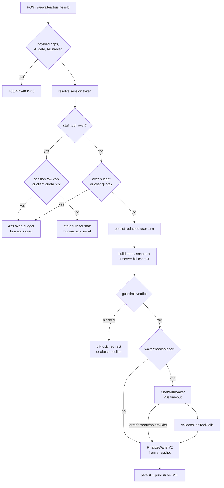

# AI waiter

The AI waiter is the chat a guest opens from a table QR page or a business's
public page. It answers menu questions, explains sold-out dishes, does bill
arithmetic and, when ordering is open, puts dishes in the guest's cart.

The waiter is built so that **the model is optional**. Most turns never reach
a model. When a model is called, its output is treated as untrusted
suggestions that the server checks and rewrites.

## Routes

All four routes are public. They are mounted in
[main.go](../../backend/cmd/app/main.go); search for `/ai-waiter/:businessId`.

| Route | Handler | Rate limit |
|---|---|---|
| `POST /api/v1/ai-waiter/:businessId/session` | `CreateAIWaiterSession` in [ai_waiter_session_handler.go](../../backend/internal/server/ai_waiter_session_handler.go) | 20/min per business per client IP, plus at most 60 new sessions per IP per hour (`allowSessionCreate` in [ai_waiter_budget.go](../../backend/internal/server/ai_waiter_budget.go)) |
| `POST /api/v1/ai-waiter/:businessId` | `HandleAIWaiter` in [ai_waiter_handler.go](../../backend/internal/server/ai_waiter_handler.go) | 20/min per business per client IP, burst 3 |
| `GET /api/v1/ai-waiter/:businessId/messages` | `GetAiWaiterMessages` in the same file | 30/min per business per client IP |
| `GET /api/v1/ai-waiter/:businessId/stream` | `HandleAIWaiterStream` in [ai_waiter_stream_handler.go](../../backend/internal/server/ai_waiter_stream_handler.go) | 30/min per business per client IP |

The per-minute limits come from `BusinessRateLimit` in
[rate_limiter.go](../../backend/internal/middleware/rate_limiter.go). The key
is the business plus the client IP, so each guest gets their own allowance and
many guests at one venue do not share it. These limits are in memory and per
replica. They are not a spend cap: the durable cap on what a busy venue can
spend is the per-business dollar ceiling in
[cost-and-budgets.md](cost-and-budgets.md).

Staff see, claim, pause and answer conversations from the dashboard under
`/api/v1/inside/businesses/:id/ai/conversations/*`. These routes need the
`ai_waiter:read` or `ai_waiter:reply` permission. The operator sandbox under
`/ai/test-chat` uses the same handler with a reserved table code, which it
keeps apart from guest data.

## One turn, step by step

The handler is long because it is explicit. In order:

1. **Payload caps.** At most 40 history entries, 4096 bytes per message, 2048
   bytes of `bill_context` and 32 bytes of `mode`. Anything larger gets
   `413 payload_too_large`. The constants are at the top of
   [ai_waiter_handler.go](../../backend/internal/server/ai_waiter_handler.go).
2. **Availability.** A business the server administrator suspended or
   closed answers `403 business_unavailable`. Then the business's own
   `AiSettings.AiEnabled` toggle must be on, or the reply is `403`.
3. **Scope.** `validateAIWaiterPublicScope` checks the mode (for example
   `ordering` at a table) and the table code against the business.
4. **Session.** The token is taken from the request body (`session_token`,
   or `session_id` for older clients). Without one, the handler falls back to
   the HttpOnly `pv_ai_waiter_session` cookie. Sessions live 24 hours
   (`aiWaiterSessionTTL`), and an expired session returns
   `401 session_expired`.
5. **Human takeover.** If staff paused the AI, no model is called. The turn
   must still pass two caps, or the reply is `429 over_budget` and nothing is
   stored: at most 120 rows in the session (guest, AI and staff rows
   together; twice the AI cap, so a guest whose AI session is full can keep
   talking to the person who took over), and the per-IP and per-device daily
   caps from step 6. An admitted turn is stored for the staff member who is
   answering, and the guest gets a localized "a person is helping you"
   notice with `human_ack: true` and no AI output. If no staff member holds
   an active claim, an urgent takeover alert is raised as well.
6. **Budget and quotas.** These checks run *before* the turn is stored, so a
   client hammering an over-budget session cannot keep growing the message
   table. Any of them returns `429 over_budget`:
   - 60 messages per session and a per-business daily message count
     (`AI_WAITER_DAILY_MESSAGE_BUDGET`, default 2000), both in
     [ai_waiter_budget.go](../../backend/internal/server/ai_waiter_budget.go);
   - the business's **guest-scope** daily USD ceiling, the **guest pool**
     that all guest traffic on the instance shares, and the
     instance-wide ceiling (`guestAIOverDollarBudget`). The guest scope is
     separate from the owner's, and the guest pool keeps part of the
     instance budget in reserve, so guests cannot exhaust the owner's own AI
     tools;
   - per-IP and per-device daily message caps (`takeGuestAIQuota` in
     [ai_guest_quota.go](../../backend/internal/server/ai_guest_quota.go)).
   The operator sandbox skips the daily message count and the per-client
   caps, but still honours the session cap and the USD ceilings. Details are
   in [cost-and-budgets.md](cost-and-budgets.md).
7. **Persist the user turn.** The text is stored after `pii.Redact` (see
   [guardrails.md](guardrails.md#pii-redaction)).
8. **Grounding.** The menu snapshot is built (next section). If the
   inventory read behind it fails, the handler returns `503` instead of
   guessing what is in stock.
9. **Guardrail.** The last user message is classified with a 2-second
   timeout. A blocked turn gets a fixed, localized redirect
   (`WaiterOffTopicRedirect`), or `WaiterAbuseDecline` for abuse, and never
   reaches the model.
10. **Model or no model.** See [When the model is called](#when-the-model-is-called).
11. **Finalize, persist, publish.** The answer always goes through
    `FinalizeWaiterV2`. The result is stored and pushed to the guest's SSE
    stream.

### WhatsApp

The WhatsApp waiter exists only in builds with the `whatsapp` tag. Inbound
messages do not go through the HTTP handler. `processMessage` in
[whatsapp_manager.go](../../backend/internal/services/whatsapp_manager.go)
applies its own checks, cheapest first, and answers a refused message with a
short localized notice:

1. at most 4096 bytes per message;
2. at most 10 AI replies per sender per minute;
3. a daily per-sender cap that reuses `AI_WAITER_DAILY_MESSAGES_PER_DEVICE`
   (default 150), because a phone number is this channel's device. It is
   keyed by a hash of the number without its device part, so linked devices
   share it, and it counts across every business on the instance
   ([whatsapp_sender_quota.go](../../backend/internal/services/whatsapp_sender_quota.go));
4. the same AI entitlement and `AiEnabled` toggle as the web waiter;
5. the guardrail classifier;
6. the business's daily message count and the guest, public and
   instance-wide dollar ceilings.

Only then is the redacted turn stored. A paused conversation gets the
takeover notice and no model call. Otherwise the stock and promotion
context is built by `BuildWaiterRuntimeContext` and the model is always
called. This channel is simpler than the web waiter: it has no deterministic
answers, no cart actions and no `FinalizeWaiterV2`. The model's text goes
to the guest after one post-check, which appends a "confirm with staff" note
when it mentions allergens; prices and availability in that text are not
checked against the menu. With no model configured it answers with an "AI
unavailable" notice. The per-minute and per-day sender counters live in
memory, per replica.

## The menu snapshot

[`BuildWaiterMenuSnapshot`](../../backend/internal/server/ai_waiter_menu_snapshot.go)
builds one canonical, localized view of the menu for the turn. It runs after
translations, active offers and bundles, stock, opening hours and ordering
toggles have been resolved. Prompt data, allergen answers and cart validation
all read from this one snapshot. No later step rebuilds menu identity from
raw rows.

- **Sold-out dishes stay visible.** Items that inventory marks as unsellable
  ([`UnrecommendableMenuItemIDs`](../../backend/internal/database/inventory.go))
  and items an operator switched off keep `is_available: false`. The waiter
  can therefore say "that is sold out" instead of pretending the dish does
  not exist. They never enter the recommendation or order maps.
- **Ordering is a server decision.** `OrderingOpen` is true only when the
  mode is `ordering`, the business is open now, and the kitchen toggle,
  the orders toggle are on, and the business is not suspended or closed. Every orderable flag in the
  snapshot derives from it.
- **Images are sanitized.** Image URLs that do not point at the trusted
  public storage host are dropped from the prompt projection.
- **Prices are the menu's own.** Menu item prices are `float64` values in
  the menu JSON, not the `int64` cents used by bills. See
  [architecture/money-flow.md](../architecture/money-flow.md).

The bill context is also computed on the server, from the table's open bill
(`buildServerBillContext`). A client-supplied `bill_context` is accepted for
compatibility, logged as deprecated, and ignored.

## When the model is called

[`waiterNeedsModel`](../../backend/internal/server/ai_waiter_handler.go)
decides. It returns true only for:

- a request for a joke (`WaiterJokePrompt` in
  [waiter_discovery.go](../../backend/internal/services/waiter_discovery.go));
- an explicit cart request such as "add two empanadas"
  (`explicitWaiterCartIntent` in
  [ai_waiter_v2.go](../../backend/internal/server/ai_waiter_v2.go)). It
  does **not** call the model when the one matched dish is unavailable, or
  when the turn is a visit question that only borrows cart words ("can I
  order at 10:30pm?").

Everything else is answered by the deterministic finalizer from the
snapshot: the full menu, sold-out lists, opening hours and visit facts, bill
splits and tips, tables, service calls, wait times, categories,
recommendations, pairings, alternatives and specific items.

When the model is called, `ChatWithWaiter` in
[ai.go](../../backend/internal/services/ai.go) gets:

- a system prompt from the per-locale prompt files. Every untrusted block
  (menu, offers, bundles, business description, owner notes, bill,
  reservation and delivery facts) is wrapped by `wrapDataBlock` with a
  random marker per block;
- the **server-side transcript** (`buildAuthoritativeWaiterHistory`), not the
  client's `history` array, so a guest cannot forge earlier assistant turns;
- exactly one tool, `add_to_cart`, with a strict JSON schema;
- a timeout of `llm.FeatureTimeout("waiter")`, which is 20 seconds (see
  [config.go](../../backend/internal/llm/config.go)).

If there is no provider, or the call fails or times out, the handler logs it
and answers from the snapshot. The guest never sees a provider error.

## Tool validation

The model can only *ask* to add something to the cart.
[`validateCartToolCalls`](../../backend/internal/server/ai_waiter_tool_validation.go)
runs before any tool call is shown to the guest or saved:

- The target must be an **available** menu item or an **active** bundle from
  the snapshot's orderable view. Menu item IDs that appear twice in the menu
  are treated as ambiguous and rejected.
- A call naming both `menu_item_id` and `bundle_id` is rejected. A call with
  neither key may resolve by exact normalized name, but only when exactly one
  entity has that name.
- `quantity` must be an integer from 1 to 20.
- `notes` must be a string. It is cleaned with `SanitizePromptField` and cut
  to 200 characters.
- The arguments are **rebuilt** from server data: the canonical name, price
  and currency replace whatever the model sent.

Rejected calls are counted and logged. Then
[`FinalizeWaiterV2`](../../backend/internal/server/ai_waiter_v2.go) applies a
second layer:

- It keeps at most 8 selections per turn. If the same entity is asked for
  twice with different quantities or notes, both requests are dropped as
  ambiguous.
- If ordering is closed, a validated cart call becomes a "ordering is
  paused" message (`StatusBlocked`) instead of an action.
- If the guest asked for something and every call was rejected, the reply
  says so (`finalizeRejectedWaiterCart`).

The same validator is exported as `ValidateCartToolCallsForContract`, so the
hermetic contract suite tests the production code path. See
[evals.md](evals.md).

## Allergens and alcohol

- **Allergen answers come only from menu data.** `FinalizeWaiterV2` routes
  an allergen intent to `finalizeWaiterAllergen` before it looks at any model
  output. For one matched dish it lists the allergens recorded on that dish.
  For "I can't eat X" it suggests dishes not tagged with X. When it cannot
  tell which dish is meant, it asks. Every allergen answer includes a
  localized disclaimer and the `allergen-staff-confirmation` warning notice,
  which tells the guest to confirm with staff.
- **Alcohol is filtered for some asks.** If the guest mentions pregnancy,
  children, a designated driver or an alcohol-free request,
  [ai_waiter_alcohol.go](../../backend/internal/server/ai_waiter_alcohol.go)
  removes alcoholic entities from recommendations. The menu has no
  "alcoholic" column, so this is a word-list heuristic over names and
  category names. It is deliberately biased toward over-detection.

See [guardrails.md](guardrails.md) for the full picture.

## Streaming

The waiter has a **message-delivery** stream, not token streaming. A reply is
built in full, stored, and then published as one event.

- `GET /api/v1/ai-waiter/:businessId/stream` is Server-Sent Events. It sends
  `connected`, then `message.created` for every assistant or staff message
  stored in the conversation, and a `: ping` comment every 15 seconds.
- The stream accepts **only** an `Authorization: Bearer <session token>`
  header. It rejects the cookie and URL tokens on purpose: another table
  opened in the same browser could overwrite the cookie and attach the stream
  to the wrong conversation. Operator sandbox sessions are rejected too.
- The hub ([aiwaiterevents/hub.go](../../backend/internal/aiwaiterevents/hub.go))
  is in-process and keyed by conversation ID. Each subscriber has a
  16-event buffer, and a slow consumer drops events instead of blocking the
  publisher. Structured payloads are validated against the assistant
  contract before they are sent.

Because the hub is in-process, live updates work only when the guest's
stream and the request that wrote the message hit the **same backend
process**. With several replicas the guest falls back to polling
`/messages`. See [architecture/realtime.md](../architecture/realtime.md).

## Locales

The guest UI supports 21 locales. The waiter's coverage is uneven, and this
section states it plainly.

| | en, es, es-AR | Other 18 guest locales |
|---|---|---|
| Deterministic answers (menu, sold out, hours, bill, allergens) | yes | yes; finalizer copy is localized ([ai_waiter_v2_copy.go](../../backend/internal/server/ai_waiter_v2_copy.go)) |
| Cart intent detected, model called | yes | **no**; `explicitWaiterCartIntent` returns false |
| Joke prompt detected | yes | no |
| Model small talk used as prose | yes (`waiterNativeSmallTalkLocale`) | no; a fixed social reply or safe fallback is used |
| Reviewed system prompt | yes | no; the prompt files carry `review_pending: true` |

In practice, guests in the other 18 locales get a grounded menu assistant
that cannot add items to the cart by chat. They can still order from the
menu UI.

Prompt resolution is done by `resolveWaiterPrompt` in
[waiter_prompts.go](../../backend/internal/services/waiter_prompts.go). The
prompts live in
[services/prompts/ai_waiter/](../../backend/internal/services/prompts/ai_waiter/)
as one file per family (`ordering`, `concierge`, `whatsapp`) and locale. A
file marked `review_pending: true` is skipped. The English body is used
instead, and the model is told to answer in the guest's language.

`isGuestLocale` in
[waiter_locale.go](../../backend/internal/services/waiter_locale.go) also
accepts `he`, which has no prompt files and is not one of the 21 guest
locales. It resolves to the English prompt.

## No model configured

With no provider, the waiter keeps working. Every turn takes the
deterministic path described above, and the waiter routes never answer
`503 ai_not_configured`: that response is reserved for routes that cannot
work without a model (see [README.md](README.md#what-happens-with-no-model-configured)).

Guest business projections carry `ai_waiter_mode`, computed by `aiWaiterMode`
in [ai_entitlements.go](../../backend/internal/server/ai_entitlements.go):
`"llm"` when a provider is configured, `"basic"` for the deterministic
fallback. It sits next to `ai_available`, which means "the business is
operational and the owner switched it on".

## Files

| File | What it owns |
|---|---|
| [ai_waiter_handler.go](../../backend/internal/server/ai_waiter_handler.go) | Request pipeline, model call, fallback |
| [ai_waiter_v2.go](../../backend/internal/server/ai_waiter_v2.go) | Intent classification and `FinalizeWaiterV2` |
| [ai_waiter_v2_copy.go](../../backend/internal/server/ai_waiter_v2_copy.go) | Localized deterministic copy |
| [ai_waiter_menu_snapshot.go](../../backend/internal/server/ai_waiter_menu_snapshot.go) | The canonical menu view |
| [ai_waiter_tool_validation.go](../../backend/internal/server/ai_waiter_tool_validation.go) | `add_to_cart` validation |
| [ai_waiter_session_handler.go](../../backend/internal/server/ai_waiter_session_handler.go) | Session minting, cookie, TTL |
| [ai_waiter_stream_handler.go](../../backend/internal/server/ai_waiter_stream_handler.go) | SSE delivery |
| [ai_waiter_budget.go](../../backend/internal/server/ai_waiter_budget.go) | Message caps and the per-IP session limiter |
| [ai_waiter_alcohol.go](../../backend/internal/server/ai_waiter_alcohol.go) | Alcohol-free filtering |
| [services/ai.go](../../backend/internal/services/ai.go) | `ChatWithWaiter`, tool schema |
| [services/waiter_prompts.go](../../backend/internal/services/waiter_prompts.go) | Prompt resolution and spotlighting |
