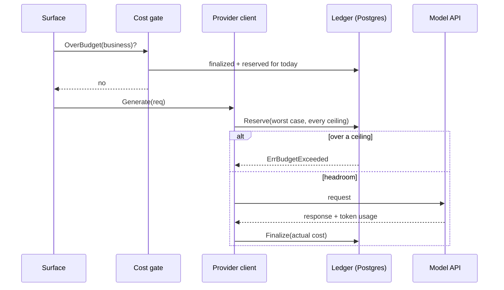

# Cost and budgets

Every model call costs money, and some AI surfaces are open to anonymous
visitors. Payverge bounds spend in two layers:

1. **A durable dollar ledger.** Every provider call reserves its worst-case
   cost before it runs and settles the real cost afterwards. Daily ceilings
   are enforced in Postgres, so they hold across restarts and replicas.
2. **Cheap counters in front of it.** Per-session, per-IP and per-device
   message caps stop a single client long before it can reach the dollar
   ceiling.

Whenever a provider is configured, every ceiling is mandatory. An unset,
unparseable, zero or negative value falls back to the default with a warning.
There is no way to switch the caps off, in any mode.

## Daily dollar ceilings

Resolved by `resolveAIBudgetConfig` in
[oss_sec_ai.go](../../backend/cmd/app/oss_sec_ai.go). There are three
ceilings, all per UTC day. A ceiling you leave unset is derived from the ones
above it, so the defaults always nest:

| Variable | Default when unset | What it caps |
|---|---|---|
| `AI_DAILY_BUDGET_USD` (alias `AI_BUDGET_PER_BUSINESS_USD_DAY`) | `$5` | Each business, applied **separately** to its owner scope and its guest scope, so one business can spend up to twice this |
| `AI_BUDGET_GLOBAL_USD_DAY` | max(`$20`, 2 × per-business) = `$20` | Every call on the instance |
| `AI_BUDGET_GUEST_POOL_USD_DAY` | global ÷ 2 = `$10` | Unauthenticated traffic: guest waiter turns at every business |

The **owner scope** covers the director, ops assistant, setup wizard, menu
AI, images and marketing. The **guest scope** covers the AI waiter on the web
and WhatsApp, and the guardrail calls that screen guest messages.
`BudgetScopeFor` in
[call_budget.go](../../backend/internal/llm/call_budget.go) picks the scope
from the request's explicit audience, or else from its feature.

The **guest pool** sits inside the global one. Guests at every business can
spend at most that much between them, so the rest of the global ceiling
(another `$10` by default) stays reserved for owners and staff. Anonymous
traffic cannot lock an owner out of their own tools.

Every call must fit under all of its ceilings at once (`scopesFor` in
[call_budget.go](../../backend/internal/llm/call_budget.go)):

| Caller | Ceilings charged |
|---|---|
| Owner and staff tools | the business's owner scope, global |
| AI waiter, web and WhatsApp | the business's guest scope, guest pool, global |

Setting one ceiling moves the derived ones with it. For example,
`AI_BUDGET_GLOBAL_USD_DAY=100` alone gives a `$50` guest pool. The backend logs a warning at startup when explicit values
do not nest:

- global below twice the per-business ceiling, so the instance cap trips
  before any single business reaches its own;
- guest pool equal to global, which leaves owners no reserve (a pool above
  global is clamped to global).

These variables, like `OPENROUTER_PRICES`, are read from the backend's
environment. A value in `.env` has no effect unless the compose file passes
it to the backend; see
[providers.md § Passing variables through Compose](providers.md#passing-variables-through-compose).

## How a call is charged



- **Pre-check.** Surfaces ask an `AICostGate`
  ([cost_gate.go](../../backend/internal/llm/cost_gate.go)) before doing any
  work, so an exhausted business gets a fast, friendly refusal. The gate reads
  finalized plus reserved spend for today on the same ceilings the call will
  be charged to. A ledger read error counts as over budget.
- **Reserve.** `CallBudget.ReserveForRequest` in
  [call_budget.go](../../backend/internal/llm/call_budget.go) runs inside the
  provider client (`openrouter.WithBudget`). It estimates the input tokens,
  assumes the full `max_tokens` output (8,192 when the caller sets none), and
  prices that with the price table. `BudgetStore.Reserve` in
  [budget_store.go](../../backend/internal/llm/budget_store.go) takes row
  locks on the `ai_daily_spend` row of every ceiling the call is charged to,
  and refuses with `ErrBudgetExceeded` if the worst case would cross any of
  them.
- **Finalize or release.** After a response, the reservation is replaced by
  the real cost from the reported token usage. After a provider failure, the
  reservation is released.
- **Crash recovery.** A reservation has a 2-minute TTL
  (`DefaultReservationTTL`). An hourly sweep (`ExpireStale`) settles stale
  rows. A call whose outcome is unknown keeps its full worst-case charge, so a
  crash never gives headroom back.

Amounts are integer **micro-USD** (`MicroUSDPerUSD = 1_000_000`), for the same
reason bills use integer cents: see
[ADR 0003](../adr/0003-money-as-int64-cents.md).

The ledger tables (`ai_daily_spend`, `ai_spend_reservations`,
`ai_budget_controls`) are part of the
[genesis baseline](../../backend/schema/genesis/current_schema.sql).
They hold token counts and model names only, never prompt text.

## Prices

The price table is `defaultPrices` in
[cost.go](../../backend/internal/llm/cost.go), in USD per million tokens:

| Model | Input | Output |
|---|---|---|
| `google/gemini-2.0-flash-001` | 0.10 | 0.40 |
| `google/gemini-2.5-flash` | 0.30 | 2.50 |
| `google/gemini-2.5-flash-image` | 0.30 | 2.50 |
| `google/gemini-2.5-flash-lite` | 0.10 | 0.40 |

Cached input tokens are charged at 25% of the input price. Add or override
entries with `OPENROUTER_PRICES=model=in/out,model=in/out`. An explicit `0/0`
is a valid price.

**An unpriced model is handled by endpoint class.** The classes are defined
in [providers.md § Endpoint classes](providers.md#endpoint-classes).

- **OpenRouter.** Every configured primary and fallback model must be priced
  (`ValidateConfiguredModelsPriced`). A missing price stops startup in
  production. If OpenRouter serves a model with no price at runtime, the call
  is charged at its worst case and a durable, cluster-wide shutdown latch is
  set. Every later call refuses with `ErrUnpricedModel` until an operator
  fixes the price table and clears the latch.
- **Local endpoint** (Ollama, vLLM or LiteLLM on your own network). A missing
  price is a startup warning, and those calls are booked at **$0**. The
  ceilings then cannot trip on them. To enforce ceilings on a self-hosted
  model, give it a price in `OPENROUTER_PRICES`.
- **Hosted endpoint** (any other public OpenAI-compatible vendor). A missing
  price is a startup warning, but the calls are **not** free: while a budget
  cap applies, which is always the case in production, a call to an unpriced
  model is refused. A reported model id that is neither the configured id nor
  a dated snapshot of it sets the same shutdown latch as on OpenRouter.

Clear the latch after fixing the price table:

```sql
UPDATE ai_budget_controls SET unpriced_model_shutdown = false WHERE id = 1;
```

## Message and client caps

These run before the dollar ledger and are much cheaper to check.

**AI waiter** (guest scope). All return `429 over_budget` before the turn is
stored. See [ai-waiter.md](ai-waiter.md).

| Cap | Default | Where |
|---|---|---|
| Messages per session | 60 | [ai_waiter_budget.go](../../backend/internal/server/ai_waiter_budget.go) |
| Messages per business per day | `AI_WAITER_DAILY_MESSAGE_BUDGET` = 2000 | same |
| New sessions per IP per hour | 60 | same |
| Messages per IP per day | `AI_WAITER_DAILY_MESSAGES_PER_IP` = 600 | [ai_guest_quota.go](../../backend/internal/server/ai_guest_quota.go) |
| Messages per device per day | `AI_WAITER_DAILY_MESSAGES_PER_DEVICE` = 150 | same |
| Rows in a session staff have taken over | 120, counting guest, AI and staff rows | [ai_waiter_budget.go](../../backend/internal/server/ai_waiter_budget.go) |

The per-IP cap is generous because a busy restaurant's guest Wi-Fi puts many
diners behind one address. The per-device cap is the tight one. A device is
identified by the `pv_ai_device` cookie: HttpOnly, valid for 180 days, and
signed by the server ([signedid](../../backend/internal/signedid/)), so a
client cannot mint fresh device IDs. A client that drops cookies is still
held by the per-IP cap. Turns in a taken-over session make no model call,
but they still count against the per-IP and per-device caps.

**WhatsApp waiter** (guest scope). 10 replies per sender per minute, and
`AI_WAITER_DAILY_MESSAGES_PER_DEVICE` (default 150) messages per sender per
day, counted across every business on the instance. The sender is the phone
number, so all of its linked devices share one allowance. Then the same
per-business message count and guest dollar ceilings apply. See
[ai-waiter.md § WhatsApp](ai-waiter.md#whatsapp).

**Images.** A per-business fair-use quota of 500 images a day, refunded when
generation fails. See [menu-ai.md](menu-ai.md#images-and-marketing).

## Timeouts

Each feature has a context ceiling, set by `featureTimeouts` in
[config.go](../../backend/internal/llm/config.go):

| Feature | Timeout |
|---|---|
| Guardrail classifier | 2 s |
| AI waiter | 20 s |
| Setup wizard, ops assistant, marketing | 30 s |
| Director | 35 s |
| Menu extraction, image generation | 60 s |

The agent loops also cap the number of model turns per answer (6 for the
director and the ops assistant).

## Observability

`DailyCostRollup` in [observe.go](../../backend/internal/llm/observe.go) and
the hourly ledger sweep publish spend per UTC day as metrics. They never
authorize a call; only the ledger does.

## Known limitations

- **The per-IP, per-device and per-sender counters are per replica.** They
  live in memory ([dailyquota](../../backend/internal/dailyquota/)) and reset
  on restart. With several backend replicas, a client gets that many times
  the allowance. The dollar ceilings are durable and shared, so total spend
  stays bounded.
- **The default ceilings are small.** `$5` per business, `$20` for the
  instance and `$10` for all guest traffic suit a small install or a trial. A
  busy multi-venue instance should raise `AI_BUDGET_GLOBAL_USD_DAY` first; the
  guest pool follows it unless it is set explicitly.
- **Unpriced models on a local endpoint are not capped** unless they are
  given a price, as described above.
- **An unpriced hosted model is unusable, not cheap.** Every budget-capped call
  to it is refused until it is priced, so a missing `OPENROUTER_PRICES` entry
  looks like an AI outage rather than a startup failure. Check the startup
  warnings first, then check that the variable reaches the backend at all
  ([providers.md § Passing variables through Compose](providers.md#passing-variables-through-compose)).
