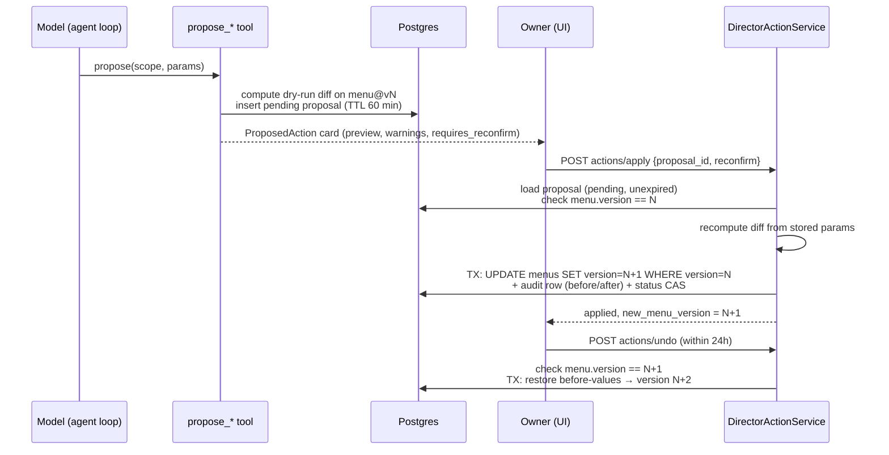

# Director console

The director console is the owner's analyst. It answers questions about
sales, menu performance, labor, reservations and the floor by calling
read-only tools over the business's own data. It can also **propose** three
kinds of menu change. It cannot make them. A person applies every change,
and the apply is checked against the exact menu version the person
previewed.

The service is
[director_console_service.go](../../backend/internal/services/director_console_service.go).
The write path is
[director_action_service.go](../../backend/internal/services/director_action_service.go).

## Routes

All routes sit under `/api/v1/inside/businesses/:id` and pass
`RequireOperationalBusiness` (see
[business_access_middleware.go](../../backend/internal/server/business_access_middleware.go)),
which only refuses a business the server administrator suspended or closed.
Route registration is in [main.go](../../backend/cmd/app/main.go); search for
`directorConsole`.

| Route | Permission | Needs a model? |
|---|---|---|
| `POST /ai/director/ask`, `POST /ai/director/ask/stream` | `director:write` | Yes for a model answer. See [Without a model](#without-a-model). |
| `GET/PATCH/DELETE /ai/director/threads…`, pin, archive, restore, export | `director:read` / `director:write` | No |
| `POST /ai/director/messages/:messageId/feedback` | `director:write` | No |
| `GET /director-console/briefing`, `GET /director-console/proactive-insights` | `director:read` | No |
| `POST /ai/director/actions/apply`, `POST /ai/director/actions/undo` | `director:write` **and** `menu:write` | No |
| `GET /ai/director/actions/applied` | `director:read` | No |
| `POST /ai/director/actions/propose-price-change` | `director:write` **and** `menu:write` | No; no screen calls it today (API clients only) |

## Asking a question

`askInternal` runs these steps in order:

1. **Guardrail first.** The question is classified on the `director`
   surface before any business data is loaded. Abuse or injection gets a
   fixed block message. An off-topic question gets a scope redirect. See
   [guardrails.md](guardrails.md).
2. **Budget.** The service holds the owner-scope cost gate
   (`WithCostGate`, wired in [main.go](../../backend/cmd/app/main.go)). If
   the business's owner-scope daily USD ceiling or the instance-wide
   ceiling is spent, the console answers with a fixed "budget reached"
   notice and makes no model call. Each model call inside the loop also
   reserves spend before it runs. See
   [cost-and-budgets.md](cost-and-budgets.md).
3. **Context.** The service builds a JSON business context (data readiness,
   sales, menu performance and more) and loads earlier turns of the thread.
4. **Agent loop.** `runLoopOrFallback` runs `RunDirectorLoop` from
   [director_console_stream.go](../../backend/internal/services/director_console_stream.go).
   It allows at most 6 model turns, 35 seconds of wall clock and 12 seconds
   per turn. Each turn either returns the final answer or calls tools from
   the registry in
   [director_tools/](../../backend/internal/services/director_tools/).
5. **Ground and guard.** Menu-performance and sales figures in the answer
   are re-grounded against server data. Then `guardDirectorOutput` in
   [director_output_guard.go](../../backend/internal/services/director_output_guard.go)
   handles two cases. An answer that echoes the system prompt, or lists
   the allowed dashboard tabs, is thrown away and replaced with a fixed
   safe answer. An answer that repeats a sensitive context value (any value
   under a key such as `email`, `phone`, `address`, `birthday` or
   `loyalty_id`) gets that value replaced with `[redacted]`. A regex pass
   for email and phone numbers runs as a backstop.
6. **Persist.** The answer is stored with the model name that produced it.
   That name is `fallback`, `fallback_error`, `partial_timeout`, `guardrail`
   or `budget` when no model answer was used. A regenerate replaces the
   previous answer only when it produced a real model answer.

A loop timeout does not throw the work away. `partial_timeout` returns a
summary of the tool results finished so far.

### Tools

[main.go](../../backend/cmd/app/main.go) registers 21 tools (search for
`directorToolRegistry.Register`). Eighteen are read-only:

- business profile and revenue summary;
- order funnel, top items and underperformers, slow dayparts;
- CRM segment and reservation load;
- AI waiter performance and plugin status;
- food cost, margin preview and menu engineering;
- waste variance and labor cost;
- live floor, kitchen status and promotions.

Three tools stage writes:
[`tool_propose_price_change.go`](../../backend/internal/services/director_tools/tool_propose_price_change.go),
[`tool_propose_availability_change.go`](../../backend/internal/services/director_tools/tool_propose_availability_change.go)
and
[`tool_propose_content_edit.go`](../../backend/internal/services/director_tools/tool_propose_content_edit.go).

## Propose → preview → apply → undo

### Propose

A propose tool computes a **dry-run diff** with pure functions in
[director_actions/](../../backend/internal/services/director_actions/):
`ComputePriceChange`, `ComputeAvailabilityChange` and `ComputeContentEdit`.
`persistProposal` then stores a pending
[`DirectorProposedAction`](../../backend/internal/database/director_proposed_action.go)
row with:

- the menu version the diff was computed against;
- the parameters, not the computed result;
- a preview of up to 5 before/after examples;
- warnings, a `requires_reconfirm` flag and an expiry
  (`ProposalTTL` = 60 minutes, in
  [types.go](../../backend/internal/services/director_actions/types.go)).

A proposal that matches no items is refused at this point, so the model sees
the error and can re-scope.

The client receives a `ProposedAction` assembled from the stored row, never
parsed from the model's text.

Limits enforced by the compute functions:

- **Price.** `requires_reconfirm` is set when any item's price moves more
  than 50% (`PriceReconfirmSwingPct`), or when scope `all` touches more than
  one item.
- **Availability.** `requires_reconfirm` is set when scope `all` turns every
  item off.
- **Content.** Descriptions are limited to 500 runes and must be printable.
  Dietary tags must come from the canonical set. The function never reads or
  writes allergens, and the undo snapshot (`ItemSnapshot`) leaves them out
  on purpose.

If the owner's message says "don't change anything" or "preview only" (see
`directorFreezeWrites`), the price and availability tools return a preview
without storing a proposal. Any proposal created in that turn is dismissed
after the loop.

### Apply

`DirectorActionService.Apply` takes only a proposal ID and a `reconfirm`
flag from the request:

1. The proposal must exist for this business, be `pending` and not be
   expired. Otherwise: `404`, or `410 Gone`.
2. `menu.Version` must equal the proposal's `MenuVersion`. Otherwise:
   `409 menu_changed`, and the owner must preview again.
3. The diff is **recomputed from the stored parameters** against the current
   menu, so the applied diff is the same as the previewed one.
4. A diff that needs reconfirmation, applied without `reconfirm: true`,
   returns `428 reconfirm_required`.
5. A recomputed diff with no affected items returns `409 no_items_match`.
6. One transaction does three things. Any failure rolls back all of them.
   - [`ApplyMenuCategoriesTx`](../../backend/internal/database/menu_bulk_write.go)
     writes the categories with
     `UPDATE … WHERE id = ? AND version = ?` and sets `version + 1`. Zero
     rows affected means `ErrMenuVersionConflict`, which maps to `409`.
   - A `DirectorActionAudit` row stores the parameters and the before and
     after snapshots.
   - The proposal status flips from `pending` to `applied` with a
     compare-and-set. If a concurrent apply already used the proposal, zero
     rows change and the transaction aborts.

This is optimistic locking twice over: once at preview time (step 2) and
once at write time (the version-guarded `UPDATE`).

### Undo

`DirectorActionService.Undo`:

- It is allowed for 24 hours (`DirectorUndoWindow`); after that it returns
  `410`. A second undo returns `409 already_undone`.
- `menu.Version` must equal `MenuVersion + 1`, the version the apply wrote.
  If anyone changed the menu since, it returns `409 menu_changed_since_apply`
  instead of overwriting their change.
- The before-values are restored as a **new forward write** (version
  `N + 2`), not a rollback to `N`. The audit row records `undone_at` and
  `undone_by`.

## Without a model

With no provider configured, only the two chat routes need one:
`ask` and `ask/stream` answer `503 ai_not_configured` (the check sits at the
top of both handlers, see
[director_console_handler.go](../../backend/internal/server/director_console_handler.go)
and
[director_console_stream_handler.go](../../backend/internal/server/director_console_stream_handler.go)).
Briefing, proactive insights, threads, feedback, the action rail and
`propose-price-change` keep working, because they read data and never call a
model.

When a provider **is** configured but fails, `runLoopOrFallback` returns a
deterministic answer instead of an error. `buildSetupResponse` covers a
business that has not finished setup, and `buildFallbackResponse` covers the
rest. The answer is built from the same context payload and stored with
model name `fallback` or `fallback_error`.

## Known limitations

- `guardDirectorOutput` builds its denylist from the context payload only,
  not from tool results. Today the context and the tools return aggregates
  only. For example, `get_crm_segment` returns segment sizes and averages,
  not customer rows. A future tool that returns per-customer data would be
  covered only by the email and phone regex, so it needs its own scrub.
- The owner's question is stored as typed. Unlike guest surfaces, the
  director does not run `pii.Redact` on the user turn.
- Proposals cover only three menu mutation kinds. The console does not
  write anything else: no prices on bills, no staff, no inventory.
