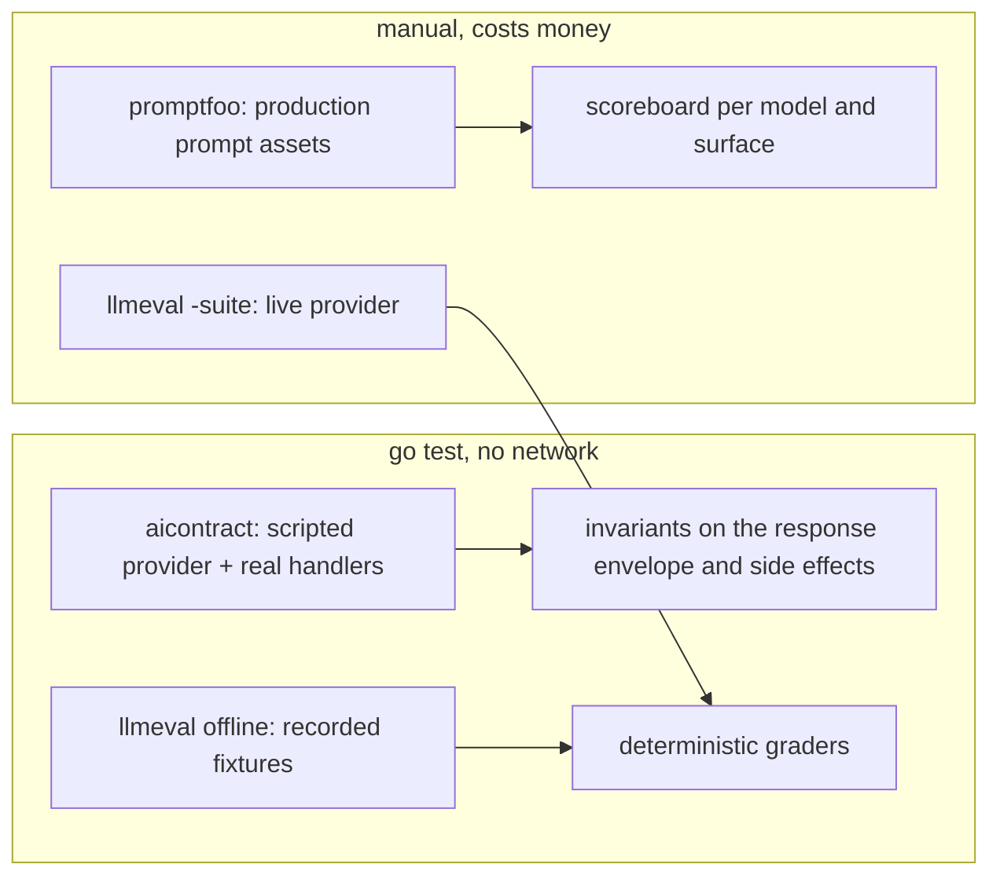

# Evals

Payverge tests its AI in three tiers. The first two are hermetic: they run in
`go test`, need no API key and make no network call. Only the third tier
calls a real model.

| Tier | Location | Network | Runs in CI | Answers |
|---|---|---|---|---|
| Contract scenarios | [internal/aicontract](../../backend/internal/aicontract/) | No | Yes | Does the production code path keep its promises whatever the model says? |
| Fixture-replay suites | [internal/llmeval](../../backend/internal/llmeval/) | No (offline mode) | Yes | Do the graders and recorded answers still agree? |
| Live benchmarks | [evals/promptfoo](../../evals/promptfoo/) | Yes (OpenRouter) | No | Which model, on our real prompts, answers best? |



## Contract scenarios (`aicontract`)

From the package doc: *"hermetic production-shaped AI scenario contracts …
Scenarios exercise real prompts, guardrails, normalization, and effect
boundaries while substituting only external providers and side-effect
sinks."*

- **Scenarios** are declared in
  [testdata/scenarios.yaml](../../backend/internal/aicontract/testdata/scenarios.yaml)
  (46 today). Each names a surface, a scripted model reply (often a hostile
  one: invented prices, fake URLs, a prompt-injection echo), and what must or
  must not happen.
- **The scripted provider**
  ([provider_queue.go](../../backend/internal/aicontract/provider_queue.go))
  returns the queued replies in order. It fails the test on an unexpected
  extra call, or on a call made with the wrong feature label or without
  zero-data-retention when the scenario is privacy-sensitive.
- **The effect recorder**
  ([recorder.go](../../backend/internal/aicontract/recorder.go)) captures
  side effects such as emails, escalations and cart writes, so a scenario can
  assert that a hostile reply did not trigger one.
- **Runners** are registered per surface with `RegisterScenarioRunner`
  ([matrix.go](../../backend/internal/aicontract/matrix.go)).
  `TestHermeticMatrix_AllScenariosRegistered` fails if a scenario has no
  runner. `TestAssistantV2ProductionScenarioMatrix` checks the shared response
  envelope invariants on every surface.
- **Real-path adapters**
  ([real_path_adapters_test.go](../../backend/internal/aicontract/real_path_adapters_test.go))
  drive the real handlers and services. Two of them read the promptfoo
  configs `waiter-ordering-full.yaml` and `ops-assistant-full.yaml`, so the
  live benchmark and the hermetic contract cover the same cases.

Run them:

```bash
cd backend
go test ./internal/aicontract/... ./internal/assistantcontract/... -count=1
```

## Fixture-replay suites (`llmeval`)

[llmeval](../../backend/internal/llmeval/doc.go) is a small harness. A
**case** is a YAML entry with a prompt, inputs and assertions. A **runner**
executes cases against any `llm.Provider`. A **grader** checks deterministic
assertions (regex, JSON schema or field, `contains`, language ID) and
optionally an LLM-judge assertion.

Suites live in [suites/](../../backend/internal/llmeval/suites/):
`smoke_waiter`, `smoke_director`, `allergen_redteam`, `injection_redteam`,
`exact_names`, `json_adherence`, `locale_adherence` and `director_quality`.
Recorded model answers sit under `suites/testdata/fixtures`, so the offline
run replays them through `FixtureProvider` and grades them with zero network.
[COSTS.md](../../backend/internal/llmeval/suites/COSTS.md) estimates the cost
of a live run per suite.

```bash
cd backend
make eval-offline                         # all suites, fixture replay
go run ./cmd/llmeval -suite smoke_waiter  # one suite, live (needs OPENROUTER_API_KEY)
go run ./cmd/llmeval -suite smoke_waiter -record   # refresh fixtures from live answers
```

## Live benchmarks (`evals/promptfoo`)

A [promptfoo](https://www.promptfoo.dev/) suite that compares candidate
models on the **production prompt assets**.
[lib/prod_prompts.js](../../evals/promptfoo/lib/prod_prompts.js) loads the
real files from `backend/internal/services/prompts/` and the guardrail
classifier prompt, and rebuilds the production message shape, including data
block spotlighting and the English-body fallback for unreviewed locales.

- [configs/](../../evals/promptfoo/configs/) holds 24 configs: the waiter's
  ordering and concierge modes, the director, the setup wizard, the
  guardrail classifier, menu extraction, the ops assistant, and helpfulness and red-team sets for most of them. Each carries
  that surface's production temperature, token limit and output format.
- [runner.sh](../../evals/promptfoo/runner.sh) runs the core set (waiter
  modes, director, wizard, guardrails and the shared assistant envelope) or
  one of them by name, prints a model-by-surface scoreboard, and opens the
  promptfoo viewer. It runs a pinned promptfoo release through `npx`, so it
  needs Node. A core run takes a few minutes and costs well under a dollar.
  Run any other config directly with the same pinned release:
  `npx --yes promptfoo@0.120.19 eval -c evals/promptfoo/configs/<name>.yaml`.
- `results/` is ignored except for two committed `SUMMARY.txt` scoreboards,
  kept as reference points.
- The root [promptfooconfig.yaml](../../promptfooconfig.yaml) is a small
  entry point. `npm run ai:eval:promptfoo` runs it with the pinned release,
  and `npm run ai:eval:promptfoo:full` runs `runner.sh`.

```bash
export OPENROUTER_API_KEY=...
./evals/promptfoo/runner.sh               # every surface
./evals/promptfoo/runner.sh guardrails    # one surface
./evals/promptfoo/runner.sh scoreboard    # reprint the last run, no API calls
```

The [README](../../evals/promptfoo/README.md) lists its deliberate deviations
from production. Tools are not sent, because promptfoo grades text, and the
director runs a single turn instead of its tool loop.

## CI

The backend job in [.github/workflows/ci.yml](../../.github/workflows/ci.yml)
runs the offline `llmeval` suites and the `aicontract` and
`assistantcontract` packages on every pull request. **No CI job calls a live model.**

## Writing a new eval

- **A safety promise** (the model must never be able to do X): add an
  `aicontract` scenario with a hostile scripted reply. It is cheap, it is
  deterministic, and it tests the code that enforces the promise.
- **A quality bar** (answers should be good at Y): add an `llmeval` case,
  record its fixture with `-record`, and commit both.
- **A model choice** (is model A better than B on our prompts?): add or
  extend a promptfoo config.

## Known limitations

- **Live runs assume OpenRouter.** `cmd/llmeval` and the promptfoo configs
  read `OPENROUTER_API_KEY` and use OpenRouter model IDs. Benchmarking an
  Ollama or vLLM model needs a promptfoo provider entry of your own.
- **Agent loops are not benchmarked end to end.** promptfoo sends no tools,
  so the director and ops assistant tool loops, and the WhatsApp
  waiter, are covered end to end only by the hermetic tiers.
- **Fixtures age.** Offline suites prove the graders and recorded answers
  agree, not that today's model still behaves that way. Re-record before a
  model change.
