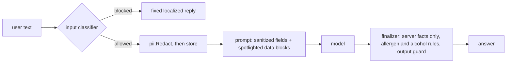

# Guardrails

This page covers the safety layers that sit around every model call. They
have one job: keep untrusted text, whether a guest message, an owner prompt
or model output, from becoming a fact, a secret leak or a harmful answer.

| Layer | Where | Runs on |
|---|---|---|
| [Input classifier](#input-classifier) | [internal/guardrails](../../backend/internal/guardrails/) | Every surface, before the model |
| [PII redaction](#pii-redaction) | [internal/pii](../../backend/internal/pii/) | Stored guest, staff and visitor turns |
| [Prompt spotlighting and the leakage invariant](#prompt-spotlighting-and-the-leakage-invariant) | [waiter_prompts.go](../../backend/internal/services/waiter_prompts.go) | Waiter system prompts |
| [Allergens](#allergens) | [allergen_intent.go](../../backend/internal/services/allergen_intent.go) | Waiter answers |
| [Alcohol](#alcohol) | [ai_waiter_alcohol.go](../../backend/internal/server/ai_waiter_alcohol.go) | Waiter recommendations |
| [Output guards](#output-guards) | Per-surface finalizers | Every answer, after the model |

## Input classifier

[`InputClassifier`](../../backend/internal/guardrails/guardrails.go) takes
one message, a surface and a locale, and returns a `Verdict`:
`Allowed`, a `Category` (`ok`, `off_topic`, `abuse` or `injection`) and a
short log-safe reason. It sees only the latest message, never the history.

The surfaces in use are `ai_waiter`, `director`, `ops_assistant` and
`image_prompt`. The rubric for each is in
[prompts/classifier.md](../../backend/internal/guardrails/prompts/classifier.md).
For example, the waiter's scope is this restaurant's menu, food, ordering and
dining, and `image_prompt` accepts terse style fragments such as "rustic
wooden table, warm light" but not real people or third-party brands.

Implementations:

- **`AllowAll`** allows everything. It is the default when no provider is
  configured.
- **`GeminiClassifier`** in [gemini.go](../../backend/internal/guardrails/gemini.go)
  makes one strict-JSON call to the guardrail model
  (`OPENROUTER_MODEL_GUARDRAIL`, see [providers.md](providers.md)) with a
  2-second timeout. Despite the name it works with any model the provider
  serves.

One classifier instance is built in [main.go](../../backend/cmd/app/main.go)
(search `NewGeminiClassifierStrict`) and handed to every surface.

### Fail-open or fail-closed

A classifier can fail: the model is down, the call times out, or the JSON
does not parse. What happens next is set by `GUARDRAIL_STRICT`, resolved in
[guardrail_strict.go](../../backend/cmd/app/guardrail_strict.go):

| `GUARDRAIL_STRICT` | Production | Development |
|---|---|---|
| unset | fail **closed**: the message is treated as `off_topic` | fail **open**: the message is allowed and the failure is logged |
| `true` | fail closed | fail closed |
| `false` | fail open | fail open |

Fail-closed costs some false refusals while the guardrail model is down. It
avoids forwarding unscreened public input to the answering model.

### What each surface does with a block

- **AI waiter**: a fixed, localized redirect (`WaiterOffTopicRedirect`), or
  `WaiterAbuseDecline` for abuse. See [ai-waiter.md](ai-waiter.md).
- **Director**: a fixed block message for abuse or injection, a scope
  redirect for off-topic. The check runs before any business data loads.
- **Ops assistant**: abuse and injection are refused. Off-topic gets a scope
  answer built from the guide catalog.
- **Image prompts**: `evaluateImagePromptGuardrail` in
  [ai_menu_handlers.go](../../backend/internal/server/ai_menu_handlers.go)
  refuses the generation before any image call.

### Swapping in another moderation service

The seam is the interface, not the concrete type.
[doc.go](../../backend/internal/guardrails/doc.go) describes how to plug in an
external moderation API, and `TestInterfaceSwapPath` in
[guardrails_test.go](../../backend/internal/guardrails/guardrails_test.go)
keeps that path working.

## PII redaction

[`pii.Redact`](../../backend/internal/pii/redact.go) replaces email
addresses with `[redacted-email]` and phone numbers with `[redacted-phone]`.

Phone detection is deliberately narrow so that it does not eat order
numbers. A digit run is redacted only when it has at least 9 digits **and**
a context signal: a leading `+` or `(`, or a keyword such as `tel`, `phone`,
`call`, `whatsapp`, `mobile`, `teléfono` or `celular` within 16 characters
before it. ISO dates, `#` IDs, currency amounts and percentages are left
alone. The cases are pinned in
[redact_test.go](../../backend/internal/pii/redact_test.go).

Where it runs:

- **AI waiter**: every stored message
  ([ai_waiter.go](../../backend/internal/database/ai_waiter.go)), and the
  answer text in the legacy response shape
  ([ai_waiter_handler.go](../../backend/internal/server/ai_waiter_handler.go)).
- **Ops assistant**: stored user turns in
  [ops_service.go](../../backend/internal/agents/ops_service.go).
- **Escalations**: transcripts that the shared agent loop
  ([loop.go](../../backend/internal/agents/loop.go)) attaches to a support
  escalation.

Redaction applies to what is **stored or forwarded**. The model sees the
current message as typed, because it may need the details to answer. The director does not
redact the owner's turn; see
[director-console.md § Known limitations](director-console.md#known-limitations).

## Prompt spotlighting and the leakage invariant

The waiter's system prompt mixes trusted instructions with data that came
from an owner (menu names, descriptions, business notes) or a guest. Two
rules keep that data from acting as instructions:

- **Field sanitizing.** [`SanitizePromptField`](../../backend/internal/services/prompt_sanitize.go)
  strips control characters and newlines, collapses whitespace and caps the
  length of every interpolated field.
- **Spotlighting.** `wrapDataBlock` in
  [waiter_prompts.go](../../backend/internal/services/waiter_prompts.go)
  wraps each untrusted block in `<data_block name="…" marker="…">`. The marker
  is 8 hex characters from `crypto/rand`, new for every render, so a menu
  item cannot forge the closing tag. Menu AI uses the same technique for
  image prompts.

The **leakage invariant** is written down in
[LEAKAGE_INVARIANT.md](../../backend/internal/services/prompts/ai_waiter/LEAKAGE_INVARIANT.md)
(OWASP LLM07): every rendered system prompt must be free of secrets, API
keys, internal hostnames and credential-bearing tokens.
`buildWaiterSystemPrompt` is the single render path.
`TestWaiterPromptsCarryNoSecrets` in
[waiter_leakage_test.go](../../backend/internal/services/waiter_leakage_test.go)
renders every guest locale in the ordering, concierge and WhatsApp modes and
fails if the output contains any of `OPENROUTER_API_KEY`, `sk-`, `Bearer `,
`postgres://`, `AWS_SECRET`, `://localhost`, `127.0.0.1` or `internal.`.

## Allergens

Allergen answers are safety-relevant, so the model is never their source.

- **Detection.** [`DetectAllergenIntent`](../../backend/internal/services/allergen_intent.go)
  matches allergen keywords in all 21 guest locales, at word boundaries.
- **Routing.** The waiter finalizer in
  [ai_waiter_v2.go](../../backend/internal/server/ai_waiter_v2.go) sends an
  allergen turn to a deterministic branch before it reads any model output.
  For one matched dish, `AllergenAnswerFromItem` lists the allergens
  recorded on that dish. With no data it uses `AllergenRefusal`. If it
  cannot tell which dish is meant, it asks.
- **Disclaimer.** Every allergen answer ends with a localized "please
  confirm with staff" line. `AppendAllergenDisclaimer` is idempotent, and
  `MentionsStaffConfirmation` stops it from being added twice.
- **Avoidance asks.** "Something without gluten" is a filter, not a
  question about one dish.
  [ai_waiter_allergen_avoidance.go](../../backend/internal/server/ai_waiter_allergen_avoidance.go)
  maps gluten, dairy and nuts to the `gluten-free`, `dairy-free` and
  `nut-free` dietary tags, and only when the message states avoidance
  (`waiterMessageStatesAvoidance`). Sesame, egg and fish have no matching tag,
  so those asks keep the refusal instead of guessing.

The menu's allergen data is entered by the owner. The disclaimer exists
because Payverge cannot check it.

## Alcohol

When a guest mentions pregnancy, children, a designated driver or asks for
something alcohol-free (`waiterAlcoholFreeAsk`),
[ai_waiter_alcohol.go](../../backend/internal/server/ai_waiter_alcohol.go)
removes alcoholic items from the recommendation set **before** the top-N
pick (`waiterRecommendableEntitiesForAsk`).

There is no "alcoholic" column on menu items, so this is a heuristic. It
looks for drink words as whole tokens in the item's names, its description
and its category title ("vino" matches, "vinagre" does not) and is biased toward over-detection: hiding a non-alcoholic drink
is a better failure than recommending wine to a pregnant guest.

## Output guards

Each surface finalizer treats model output as untrusted prose. The common
rule is described in [README.md § The one design rule](README.md#the-one-design-rule).
Surface-specific guards:

- **Waiter**: `FinalizeWaiterV2` builds entities, sources and actions from
  the menu snapshot. Cart tool calls are rebuilt by `validateCartToolCalls`.
- **Director**: `guardDirectorOutput` in
  [director_output_guard.go](../../backend/internal/services/director_output_guard.go)
  replaces answers that echo the system prompt, and masks sensitive context
  values. See [director-console.md](director-console.md#asking-a-question).
- **Ops assistant**: `FinalizeOpsV2` ignores model actions and URLs. Destinations come from the guide catalog or
  the intent registry.

## Known limitations

- The classifier is itself a model. It can be wrong in both directions, and
  in fail-open mode an outage lets everything through.
- PII redaction covers emails and phone numbers only: not names, addresses
  or card numbers typed into a chat.
- The alcohol filter is a word list. A drink with an unusual name and no
  telling category name can slip through.
- The director's output denylist is built from its context payload, not
  from tool results.
