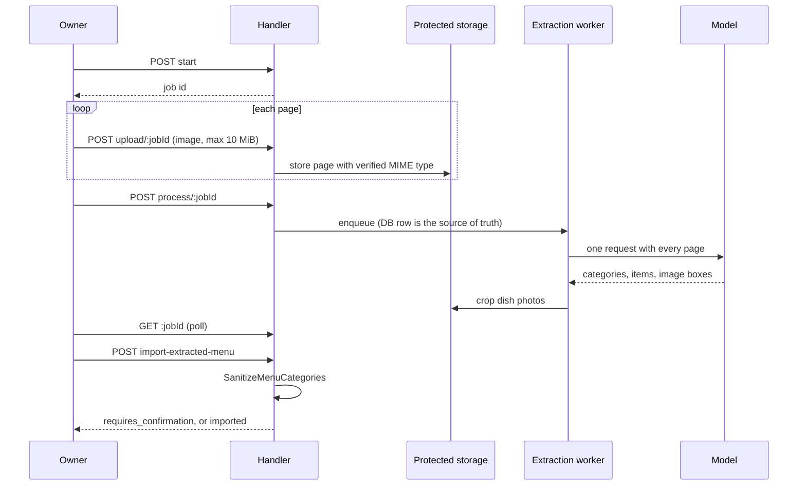

# Menu AI

Menu AI helps an owner get a menu into Payverge quickly. It has three parts:

- **Extraction**: photograph or scan a paper menu and get structured
  categories and items back.
- **Setup wizard**: describe the restaurant in a chat and get a draft menu.
- **Images**: generate, regenerate or enhance dish photos and marketing
  images, and write marketing captions.

The model only ever produces a **draft**. Nothing reaches the live menu until
the owner imports it, and the import goes through the same server-side
sanitizer as any other menu write.

The service is
[menu_ai_service.go](../../backend/internal/services/menu_ai_service.go). The
HTTP handlers are in
[ai_menu_handlers.go](../../backend/internal/server/ai_menu_handlers.go).

## Routes

All routes sit under `/api/v1/inside/businesses/:id` in one group behind
`RequireOperationalBusiness` (see
[business_access_middleware.go](../../backend/internal/server/business_access_middleware.go)).
It only refuses a business the server administrator suspended or closed.
Registration is in [main.go](../../backend/cmd/app/main.go) (search
for `aiMenuRoutes`).

| Route | Permission |
|---|---|
| `POST /ai/extract-menu/start`, `POST /ai/extract-menu/upload/:jobId`, `POST /ai/extract-menu/process/:jobId` | `menu:write` |
| `GET /ai/extract-menu/:jobId` | `menu:read` |
| `POST /ai/import-extracted-menu` | `menu:write` |
| `POST /ai/wizard/start`, `POST /ai/wizard/:sessionId/message`, `…/generate`, `…/import` | `menu:write` |
| `GET /ai/wizard/:sessionId` | `menu:read` |
| `POST /ai/regenerate-image`, `POST /ai/enhance-image`, `POST /generate-menu-image` | `menu:write` |
| `GET /marketing/suggestions` | `marketing:read` |
| `POST /marketing/image`, `POST /marketing/image/cleanup`, `POST /marketing/caption` | `marketing:write` |

A job or session ID that belongs to another business answers `404`, the same
as a missing one.

## Extraction

- **Upload.** Each page is capped at 10 MiB (`maxMenuExtractionUploadBytes`)
  and must sniff as PNG, JPEG or WebP. Pages are kept in **protected**
  storage, not the public bucket.
- **Processing** is asynchronous.
  [menu_extraction_worker.go](../../backend/internal/services/menu_extraction_worker.go)
  claims jobs atomically and runs each under a timeout. The handler only
  wakes it. If no worker is running, `process` answers `503 worker_unavailable`.
  The job row stores public error codes, never raw provider errors.
- **The prompt** (`buildExtractionPrompt`) asks the model to keep the menu's
  original language, check every page, and return a bounding box for each
  dish photo. `CropAndUploadImages` then cuts those photos out.
- **Import.** `POST /ai/import-extracted-menu` runs the draft through
  `SanitizeMenuCategories` in
  [menu_enum_validation.go](../../backend/internal/services/menu_enum_validation.go).
  It drops items priced outside the (0, 10000) range and maps allergen and
  dietary-tag IDs to the canonical sets. If anything was dropped or could
  not be mapped, the handler answers `requires_confirmation: true` with a
  report, and imports only when the owner resends with
  `confirm_sanitization: true`. The import then appends the categories and
  bumps the menu version, so a [director](director-console.md) proposal
  computed on the old menu will no longer apply.

## Setup wizard

`StartWizardSession`, `ContinueWizardConversation` and
`RetryWizardConversation` hold a short structured conversation. Every turn
asks for JSON that matches a response schema. A reply that does not parse
gets one repair request. `GenerateMenuFromWizard` turns the session into a
draft menu, and `…/import` imports it through the same sanitizer and
confirmation step as extraction.

The wizard prompts live in
[services/prompts/menu_wizard/](../../backend/internal/services/prompts/menu_wizard/)
and exist for `en`, `es` and `es_ar`.

## Images and marketing

- **Guardrail.** A custom image prompt is classified on the `image_prompt`
  surface before any generation (`evaluateImagePromptGuardrail`). See
  [guardrails.md](guardrails.md).
- **Prompt spotlighting.** User text inside `buildRegenerateImagePrompt` and
  `buildEnhanceImagePrompt` is wrapped in a random marker, the same way the
  waiter wraps menu data.
- **Fair-use quota.** Each generation reserves one unit of a per-business
  daily quota first and refunds it if generation fails
  (`reserveGenerateRefundImage`). The defaults are 500 images per day and an alert
  at 2,000 per month (`DefaultImageDailyLimit`, `DefaultImageMonthlyAlert` in
  [platform_settings.go](../../backend/internal/database/platform_settings.go)).
  The alert notifies; only the daily cap blocks. See
  [image_limits.go](../../backend/internal/server/image_limits.go).
- **Spend.** Every model call also goes through the dollar budget described
  in [cost-and-budgets.md](cost-and-budgets.md).

## Without a model

`NewMenuAIService` is called only when a provider is configured. Without
one, the extraction, wizard, dish-image and marketing-image routes answer
`503 ai_not_configured` (see
[ai_entitlements.go](../../backend/internal/server/ai_entitlements.go)). The
marketing caption route answers `200` with `ai_available: false`, so the UI
can fall back to manual entry. Menus can always be built by hand in the menu
editor.

## Known limitations

- Image generation needs an image model. The defaults
  (`OPENROUTER_MODEL_IMAGE`, see [providers.md](providers.md)) assume
  OpenRouter. On another OpenAI-compatible endpoint, image routes are likely
  to fail unless that endpoint serves a compatible image model.
- Extraction quality depends on the model and the photo. The sanitizer
  guards the data shape, not the content: an owner must still read the draft
  before importing.
- Wizard prompts exist only in en, es and es-AR.
