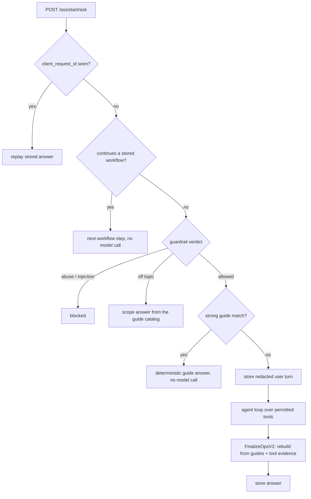

# Ops assistant

The ops assistant is the help widget in the business dashboard. It tells
owners and staff where things are, what a screen does and what to do next.
It can read the business's setup state and point the user at a tab. It
cannot change anything: every tool it has is read-only or returns a link.

The service is
[ops_service.go](../../backend/internal/agents/ops_service.go). Its tools are
registered in
[ops_tools/register.go](../../backend/internal/agents/ops_tools/register.go).

## Routes

All routes sit under `/api/v1/inside/businesses/:id` behind
`RequireOperationalBusiness`. Registration is in
[main.go](../../backend/cmd/app/main.go) (search for `opsAssistant.`), and the
handlers are in
[ops_assistant_handlers.go](../../backend/internal/server/ops_assistant_handlers.go).

| Route | Permission |
|---|---|
| `POST /assistant/ask` | `assistant:read` |
| `GET /assistant/threads/:threadId/messages` | `assistant:read` |
| `POST /assistant/messages/:messageId/feedback` | `assistant:write` |

There is no thread list, archive, restore or delete route. The widget keeps
the current thread id in `localStorage`; asking with a thread id that no
longer exists (or belongs to another business) starts a new thread.

The service is built in [main.go](../../backend/cmd/app/main.go) only when an
AI provider is configured (search for `NewOpsAssistantService`). Without one,
`ensureOpsAssistantEnabled` answers every route with
`503 ai_not_configured`.

## Answering a question

`askInternal` runs these steps:

1. **Input checks.** An empty message or one over 2,000 bytes is refused.
2. **Idempotency.** A request with a `client_request_id` is claimed in the
   database. A retry with the same ID replays the stored answer; a retry
   while the first is still running gets an in-flight error.
3. **Workflow continuation.** If the thread has a stored multi-step guide
   and the message is a short "next" or "done", the next step is returned
   without a model call
   ([ops_workflow.go](../../backend/internal/agents/ops_workflow.go)).
4. **Guardrail.** The message is classified on the `ops_assistant` surface.
   Abuse and injection are refused. Off-topic gets a scope answer built from
   the guide catalog, never a `500`. See [guardrails.md](guardrails.md).
5. **Deterministic guidance.** When the guide catalog has a strong match for
   the message and active tab, the answer comes from the catalog and the
   model is skipped.
6. **Persist.** The user turn is stored after `pii.Redact`.
7. **Agent loop.** `RunAgentLoop` in
   [loop.go](../../backend/internal/agents/loop.go) runs with the director
   model (`OPENROUTER_MODEL_DIRECTOR`). Defaults: at most 6 model turns, 30
   seconds of wall clock and 12 seconds per turn. The system prompt is
   resolved per locale. The business name and the active tab are appended
   inside `<business_name>` and `<active_tab>` tags, each labeled as data
   rather than instructions (`opsSessionContextPrompt` in
   [ops_service.go](../../backend/internal/agents/ops_service.go)). The name
   is flattened first: no control characters or angle brackets, at most 120
   characters. The tab must be a key of the dashboard tab registry, or it is
   dropped.
8. **Finalize.** `FinalizeOpsV2` in
   [ops_finalizer.go](../../backend/internal/agents/ops_finalizer.go) builds
   the reply. Its doc comment states the rule: *"Model actions, URLs, steps,
   follow-ups, workflow, and execution claims are ignored."* Navigation
   actions come from the guide catalog and the server's access snapshot. A
   state summary is shown only when a tool produced it. Action metadata that
   the model leaks into prose (`href: …`, JSON action objects) is stripped by
   [ops_leaked_actions.go](../../backend/internal/agents/ops_leaked_actions.go).
9. **Store** the answer and attach the tool-call records to it.

## Tools

Thirteen tools, all registered in
[register.go](../../backend/internal/agents/ops_tools/register.go):

| Tool | What it returns |
|---|---|
| `get_business_context`, `get_business_profile`, `get_setup_status` | Read-only setup and profile state |
| `get_active_tab_help`, `search_operator_help` | Curated help text and playbooks |
| `navigate_to_tab`, `navigate_to_settings`, `list_accessible_tabs` | Links to dashboard tabs the user can open |
| `explain_locked_feature` | Why a tab is locked (plan or permission) |
| `get_plugin_status` | Which payment and channel plugins are on |
| `get_workflow` | One step of a multi-step guide |
| `delegate_to_director` | A handoff link into the [director console](director-console.md) |
| `create_support_escalation` | Records an escalation and notifies the operator inbox |

Before each run, `authorizedOpsRegistry` projects the registry through the
caller's **access snapshot** (role, permissions, plan). The state-reading
tools are removed or narrowed when the caller lacks the matching permission:
`get_plugin_status` needs `plugins:read`, and `get_business_context` keeps
only the fields the caller may read (`ai_waiter:read`, `financial:read`). The
finalizer also hides guides the caller cannot use.

Escalation only happens through the `create_support_escalation` tool; there
is no escalation route. The tool goes through the escalation service in [internal/escalation](../../backend/internal/escalation/).
It stores the escalation, emails the instance's operator inbox
(`ADMIN_EMAILS`) and, when `TELEGRAM_ESCALATION_BOT_TOKEN` and
`TELEGRAM_ESCALATION_CHAT_ID` are set, posts to a Telegram chat. Email failure
does not fail the tool: the escalation is still recorded.

## Guides, prompts and locales

- **Guide catalog.** 27 guides in
  [ops_guides/guides_data.go](../../backend/internal/agents/ops_guides/guides_data.go),
  each with a destination tab, required permissions and follow-ups.
  [ops_intents.go](../../backend/internal/agents/ops_intents.go) matches a
  message to guides.
- **Prompts.** [services/prompts/ops_assistant/](../../backend/internal/services/prompts/ops_assistant/)
  has `en.md`, `es.md` and `es_ar.md`, plus one playbook per dashboard tab
  under `playbooks/`. Every other locale uses the English prompt
  (`resolvePersonaPrompt` in [prompts.go](../../backend/internal/agents/prompts.go)).
- **Retention.** A thread with no new message for
  `OPS_ASSISTANT_RETENTION_DAYS` (default 30) is deleted, with its messages,
  tool calls and request ledger rows, by the hourly
  [ops_assistant_retention_janitor.go](../../backend/internal/services/ops_assistant_retention_janitor.go).
  `0` disables the janitor and keeps threads until the business is deleted.

## Known limitations

- The tags around the business name are fixed strings, not the per-render
  random markers the waiter uses (see
  [guardrails.md](guardrails.md#prompt-spotlighting-and-the-leakage-invariant)).
  Angle brackets are stripped from the name, so it cannot close the tag, and
  only someone allowed to edit the business's settings can change it.
- Only en, es and es-AR have native prompts and guide copy.
- The assistant explains and links. It cannot perform an action for the user,
  by design.
