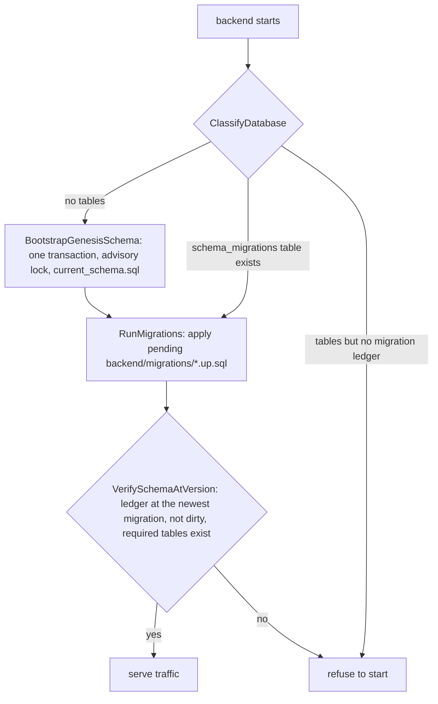

# Data and migrations

All durable state lives in one Postgres 18 database. The schema has exactly
two sources: a **genesis baseline** for empty databases and **numbered SQL
migrations** for every change after it. The application never alters the
schema any other way. The decision is recorded in
[ADR 0002](../adr/0002-postgres-genesis-and-numbered-sql-migrations.md).

## Startup, step by step

The sequence is in [main.go](../../backend/cmd/app/main.go) (search
`ClassifyDatabase`), using
[genesis.go](../../backend/internal/database/genesis.go) and
[migrate.go](../../backend/internal/database/migrate.go):

1. **Classify.** No tables in the `public` schema means *empty*. A
   `schema_migrations` table means *versioned*; it records the newest
   migration applied (the baseline itself is version 0, so the table is
   empty only on a database that predates every numbered migration).
   Anything else is *legacy*, and startup stops rather than guess.
2. **Bootstrap, only if empty.** Check the embedded
   [current_schema.sql](../../backend/schema/genesis/current_schema.sql)
   against the SHA-256 in
   [version.json](../../backend/schema/genesis/version.json), then, in one
   transaction under a Postgres advisory lock, load it, seed the default
   runtime controls and record the baseline's migration head. If two backends
   start at once, the second waits for the lock, finds the tables and skips
   the baseline. If loading fails, the transaction rolls back and the
   database stays empty.
3. **Migrate.** [golang-migrate](https://github.com/golang-migrate/migrate)
   applies every pending file in
   [backend/migrations/](../../backend/migrations/) above the recorded
   version.
4. **Verify.** `schema_migrations` must be at the newest migration this
   binary ships (no row at all when that is version 0, otherwise exactly one
   clean row), and the required tables must exist. Otherwise startup stops.

The baseline is regenerated with every migration, so a fresh install loads
it and is already at HEAD; an existing install runs only what is new. The
numbering restarted at the open-source squash (baseline = version 0); the
current head is `0`, so no numbered migration exists yet (`migration_head` in
[version.json](../../backend/schema/genesis/version.json)).

## The genesis baseline

[backend/schema/genesis/](../../backend/schema/genesis/) holds a schema-only
`pg_dump` of a reference database built from the previous baseline plus every
migration up to the new head, plus `version.json` (head, hash, Postgres major) and a
[README](../../backend/schema/genesis/README.md) on how to regenerate it.
[generate-genesis-schema.sh](../../backend/scripts/generate-genesis-schema.sh)
starts a throwaway Postgres 18 container, builds the reference schema with
[cmd/genesisgen](../../backend/cmd/genesisgen/), dumps it and normalizes the
output so the result is byte-for-byte reproducible. A companion test script
checks that determinism.

Regenerate the baseline in the same commit as every new migration (see
[backend/migrations/README.md](../../backend/migrations/README.md)), so
`migration_head` in `version.json` always names the newest migration file and
an empty database is at HEAD as soon as the bootstrap finishes.

## Writing a migration

1. Add a pair of files to `backend/migrations/`, numbered one above the
   current highest (`000001` is the first one after the squash):
   `000NNN_short_description.up.sql` and `000NNN_short_description.down.sql`.
2. Write plain Postgres SQL. Prefer additive, idempotent statements
   (`ADD COLUMN IF NOT EXISTS`, `CREATE INDEX IF NOT EXISTS`). The down file
   reverts the change, or says `-- IRREVERSIBLE` when it cannot.
3. Update the GORM model in
   [internal/database](../../backend/internal/database/) to match. The model
   describes the table for queries; it does not create it.
4. Regenerate the baseline with
   `bash backend/scripts/generate-genesis-schema.sh` and commit the migration
   pair and `backend/schema/genesis/` together.
5. Add a test when the migration moves or rewrites data, named
   `migration_NNN_*_test.go` in `internal/database`; build its database with
   `startGenesisPostgres` (or `testperf/genesisdb.Start` outside that package).

Gates that keep this the only path:

| Test | Fails when |
|---|---|
| `TestAutoMigrateSourceGate` ([automigrate_source_gate_test.go](../../backend/internal/database/automigrate_source_gate_test.go)) | A new GORM `AutoMigrate(` call appears in production code. |
| `TestProductionStartupHasNoAdHocDDL` ([production_schema_source_gate_test.go](../../backend/cmd/app/production_schema_source_gate_test.go)) | Startup gains schema-changing code outside the baseline and migrations. |
| `TestDownMigrationPolicy` ([down_migration_policy_test.go](../../backend/internal/database/down_migration_policy_test.go)) | A `.down.sql` has no real revert SQL and is not marked `-- IRREVERSIBLE`. |
| `TestRollbackRehearsal_EachMigration` ([rollback_rehearsal_test.go](../../backend/internal/database/rollback_rehearsal_test.go), Postgres) | A recent migration's `.down.sql` fails, leaves the version dirty, or does not round-trip. |
| Genesis tests ([genesis_test.go](../../backend/internal/database/genesis_test.go), build tag `integration_postgres`, needs Docker) | Bootstrap stops being atomic, idempotent, hash-checked or safe under concurrent starts. |

## What is not in the baseline

- **WhatsApp session tables.** The optional WhatsApp integration (a separate
  build, see [ADR 0008](../adr/0008-apache-2-with-whatsapp-behind-gpl-build-tag.md))
  uses a library that creates and upgrades its own tables when it first
  connects.

## Tests and databases

Most tests use SQLite through GORM for speed. Anything that depends on
Postgres behaviour (row locks, `SKIP LOCKED`, advisory locks, partial
indexes, the genesis bootstrap) runs on a real Postgres 18 container through
Testcontainers, behind a build tag. Code that relies on Postgres-only
features needs a Postgres test.

## Backups

The self-hosting stack in [deploy/](../../deploy/README.md) runs a nightly
`pg_dump` and an archive of the uploads (the `backup` profile, on by default),
with an optional off-site copy; its README covers restore. Outside that stack
the backend does not back itself up: run `pg_dump` on a schedule and keep
copies off the host. For
AWS, [infra/backup/](../../infra/backup/) has a CloudFormation stack for a
versioned, encrypted bucket with Object Lock, lifecycle rules and a
restore-only IAM policy. File uploads live in storage, not the database, and
need their own backup when you run outside the bundled stack.

## Known limitations

- **No automatic down migrations.** The `.down.sql` files exist for manual
  rollback. Startup only moves forward, and a binary refuses a database that
  is ahead of or behind it.
- **A failed migration stops startup.** golang-migrate marks the version
  dirty, and verification refuses to serve until an operator fixes the
  database and clears the flag.
- **SQLite does not prove Postgres behaviour.** A unit test passing on SQLite
  says nothing about locks or Postgres-only SQL.
- **Single database.** There are no read replicas or sharding in the code.
