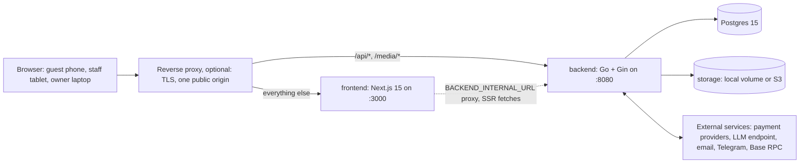

# Architecture overview

Payverge is two processes and a database. The backend is one Go binary that
owns every rule about money, permissions and data. The frontend is a Next.js
server that renders pages and, optionally, proxies API calls. Postgres holds
all durable state.

## The pieces

| Piece | Where | What it does |
|---|---|---|
| Backend | [backend/](../../backend/) | REST API under `/api/v1`, server-sent events, webhooks, background jobs, schema migrations. Entry point: [cmd/app/main.go](../../backend/cmd/app/main.go). |
| Frontend | [frontend/](../../frontend/) | Next.js 15 App Router. Guest pages (menu, ordering, bill splitting), the operator dashboard and the platform admin. |
| Database | Postgres 15 | Every business record, the AI spend ledger, sessions, webhook idempotency rows, runtime switches. |
| Storage | Local directory or an S3-compatible bucket | Menu photos and logos (public); contracts, fiscal PDFs and attachments (protected). See [self-hosting/storage.md](../self-hosting/storage.md). |
| Reverse proxy | Your choice | Terminates TLS and publishes one origin. The self-hosting stack in [deploy/](../../deploy/README.md) runs Caddy with automatic HTTPS. |

Two Compose files run the stack. [deploy/docker-compose.yml](../../deploy/docker-compose.yml)
is for running Payverge: published images, Caddy, Postgres and a nightly
backup. The root [docker-compose.yml](../../docker-compose.yml) is for
working on Payverge: it builds the backend and frontend from the checkout
and binds them to `127.0.0.1`.

Every external service is optional except the Base RPC, which defaults to
the public endpoint. See [money-flow.md § Crypto](money-flow.md#crypto-usdc-on-base).

## One origin

A self-hosted install publishes a single public origin, `PUBLIC_URL`. The
browser calls the API at `${PUBLIC_URL}/api/v1` and loads images from
`${PUBLIC_URL}/media/*`. Two ways to get there:

- **Edge routing.** The reverse proxy sends `/api/*` and `/media/*` to the
  backend and everything else to the frontend.
- **Frontend proxy.** Set `BACKEND_INTERNAL_URL` and the Next.js server
  forwards `/api/v1/*` and `/media/*` to the backend itself
  ([backendProxy.ts](../../frontend/src/lib/proxy/backendProxy.ts)). Then the
  reverse proxy only needs to reach the frontend.

The frontend image is built once and configured at runtime: the server reads
its environment per request and hands the public subset to the browser as
`window.__PAYVERGE_ENV__`
([publicConfig.ts](../../frontend/src/config/publicConfig.ts)). See
[ADR 0006](../adr/0006-same-origin-api-and-runtime-frontend-config.md) and
[self-hosting/frontend-config.md](../self-hosting/frontend-config.md).

`GET /api/v1/instance` reports the product name, branding, billing and
registration modes and which optional features are on (AI, WhatsApp,
Telegram, email, crypto and others)
([instance_handler.go](../../backend/internal/server/instance_handler.go)).
It exists so the frontend can hide what the instance does not offer, but no
screen reads it yet: an unavailable feature stays visible and its routes
answer with an error. See [Known limitations](#known-limitations).

## Inside the backend

The backend is a modular monolith: one process, one database, many internal
packages. See [ADR 0001](../adr/0001-go-gin-gorm-modular-monolith.md).

| Layer | Packages | Notes |
|---|---|---|
| Wiring | [cmd/app](../../backend/cmd/app/) | `main.go` builds every service, registers every route and starts every scheduler. It is long; search it rather than read it top to bottom. |
| HTTP handlers | [internal/server](../../backend/internal/server/), [internal/handlers](../../backend/internal/handlers/) | `server` holds auth, RBAC, guest, AI and most business handlers. `handlers` holds payments, plugins, analytics, accounting and fiscal. Both are historical splits, not a strict layering. |
| Services | [internal/services](../../backend/internal/services/) and domain packages ([splitting](../../backend/internal/splitting/), [fiscal](../../backend/internal/fiscal/), [agents](../../backend/internal/agents/), [llm](../../backend/internal/llm/), [loyalty](../../backend/internal/loyalty/), [crm](../../backend/internal/crm/) …) | Business logic. |
| Data access | [internal/database](../../backend/internal/database/) | GORM models and queries, money JSON encoding, genesis bootstrap. |
| Cross-cutting | [middleware](../../backend/internal/middleware/), [events](../../backend/internal/events/), [plugins](../../backend/internal/plugins/), [money](../../backend/internal/money/), [runtimecontrol](../../backend/internal/runtimecontrol/), [observability](../../backend/internal/observability/) | Request pipeline, realtime, payment providers, integer money helpers, kill switches, Sentry. |

Background work runs in the same process. `main.go` starts schedulers for
reports, lifecycle checks, reservations, stuck-bill and
service-call janitors, fiscal and print retry queues, crypto refunds and
plugin reconciliation. Queues that send something claim their work in
Postgres first, either with a conditional "claim before side effect" update
([schedclaim](../../backend/internal/schedclaim/schedclaim.go)) or with a
`FOR UPDATE SKIP LOCKED` queue (fiscal jobs, print jobs, the email outbox,
crypto refunds), so a duplicate tick does not send twice.

## Further reading

| Topic | Page |
|---|---|
| A request from browser to database and back | [request-flow.md](request-flow.md) |
| Bills, payments, splitting and integer cents | [money-flow.md](money-flow.md) |
| Server-sent events and polling | [realtime.md](realtime.md) |
| Payment and integration plugins | [plugins.md](plugins.md) |
| Schema ownership, migrations and backups | [data-and-migrations.md](data-and-migrations.md) |
| Every AI surface | [../ai/README.md](../ai/README.md) |
| Design decisions and their trade-offs | [../adr/](../adr/) |
| Token-lean maps of every route and package | [../CODEMAPS/](../CODEMAPS/) |

## Known limitations

- **Single-process state.** Realtime hubs, some rate limiters and some AI
  quota counters live in memory. Several backend replicas work, but each
  keeps its own copy. See [realtime.md](realtime.md#known-limitations).
- **Every replica runs every scheduler.** There is no leader election. The
  queues above are safe to run twice; not every periodic job has been
  reviewed for it, so a single backend replica is the tested setup.
- **`main.go` is the composition root for everything.** It is several
  thousand lines long. Adding a route or a scheduler means editing it.
- **The frontend ignores the capability report.** `GET /api/v1/instance`
  says which features are off, but the UI still shows billing, AI, WhatsApp
  and crypto entry points. Gating them is planned work.
- **Two handler packages.** `internal/server` and `internal/handlers` overlap
  in purpose. New code usually goes next to the feature it touches.
