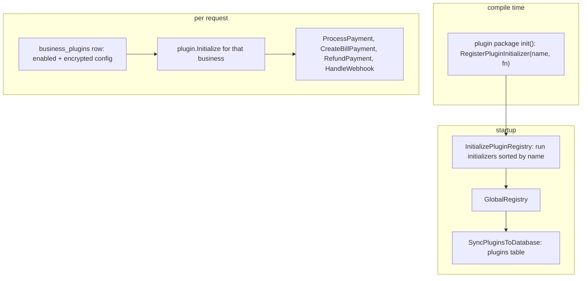

# Plugins

Payment providers and a few integrations are **plugins**: Go packages that
implement a shared interface, are compiled into the backend, and are switched
on per business. The decision is recorded in
[ADR 0005](../adr/0005-plugin-registry-for-payments.md). To configure a
provider on your server, see
[Per-business configuration](#per-business-configuration) and
[Webhooks](#webhooks) below.

## What ships

| Package | Kind | Notes |
|---|---|---|
| [stripe](../../backend/internal/plugins/stripe/) | Payment | Checkout Sessions and Stripe Connect (OAuth). |
| [paypal](../../backend/internal/plugins/paypal/) | Payment | Orders API with return and cancel URLs. |
| [mercadopago](../../backend/internal/plugins/mercadopago/) | Payment | Checkout, in-store QR and Point devices, OAuth. |
| [telegram](../../backend/internal/plugins/telegram/) | Integration | Order, payment and alert notifications to a Telegram chat. |
| [trustpilot](../../backend/internal/plugins/trustpilot/) | Marketing | Review collection through a Trustpilot business profile. |

Two helper packages are shared by the providers:
[webhookhmac](../../backend/internal/plugins/webhookhmac/webhookhmac.go), one
audited constant-time HMAC comparison for webhook signatures, and
[pluginurl](../../backend/internal/plugins/pluginurl/pluginurl.go), which
restricts any operator-supplied API base URL to the provider's own HTTPS
domain so a plugin cannot be pointed at an internal address.

## The interfaces

[interface.go](../../backend/internal/plugins/interface.go) defines them.

- **`Plugin`**, which every plugin implements: name, display name,
  description, category, version, feature list, a JSON config schema (used to
  render the settings form), `IsActive`, `ValidateConfig`,
  `Initialize(businessID, config)` and `Cleanup`.
- **`PaymentPlugin`** adds `ProcessPayment`, `CreateBillPayment`,
  `RefundPayment`, `GetPaymentStatus`, `HandleWebhook`,
  `GetWebhookEndpoint` and `VerifyWebhookSignature`.
- **Optional capabilities**, discovered with a type assertion so a plugin
  only implements what it supports: `WebhookRequestVerifier` (verification
  that needs the whole request, not just the body), `PaymentReturnCapturer`
  (capture on the browser return), `ConfigNormalizer`, `PublicConfigProvider`
  (the non-secret subset a guest page may see), `AlternativePaymentTracker`
  and `DetailedPaymentStatusProvider`.
- `IntegrationPlugin`, `ReportingPlugin` and `MarketingPlugin` for the
  non-payment kinds.

## Registration

1. Each plugin package calls `plugins.RegisterPluginInitializer(name, fn)` in
   its `init()` ([init.go](../../backend/internal/plugins/init.go)). The
   function receives the `PluginService` and usually calls
   `plugins.GlobalRegistry.RegisterPlugin(...)`.
2. `main.go` imports every plugin package, so the `init()` functions run.
3. Once services exist, `main.go` calls `plugins.InitializePluginRegistry`
   ([registry.go](../../backend/internal/plugins/registry.go)). It runs the
   initializers in name order, each behind its own panic recovery so one
   broken plugin is skipped instead of stopping boot, then
   `SyncPluginsToDatabase` upserts the catalog into the `plugins` table.

## Per-business configuration

A business turns a plugin on with a `business_plugins` row
([database/plugins.go](../../backend/internal/database/plugins.go)): an
enabled flag and a JSON config. Credential fields in that config are
encrypted with AES-256-GCM under `PLUGIN_SECRET_KEY`
([security/config_secrets.go](../../backend/internal/security/config_secrets.go))
and are never returned to a browser. In production a missing or invalid key
fails the startup checks, and a write that would store a credential in
plaintext is refused.

Handlers look a plugin up with `plugins.GetPluginByName`, load the business's
config, call `Initialize(businessID, config)`, and then call the payment
method they need. Settlement itself is not in the plugin: the plugin reports
what the provider says, and the shared webhook handler applies it to the bill
(see [money-flow.md](money-flow.md#settling-a-provider-payment)).

## Webhooks

Each provider has one fixed endpoint under `/api/v1/webhooks/`: `stripe`,
`paypal` and `mercadopago`, plus browser return URLs for PayPal and Mercado
Pago. The shared handler works out which business the event belongs to,
verifies the signature with the plugin, claims the event in an idempotency
table, and only then touches money. The steps are in
[money-flow.md](money-flow.md#settling-a-provider-payment).

## The provider contract

[payment_contract.go](../../backend/internal/plugins/payment_contract.go) is
a manifest of what every production payment provider must guarantee:
signature verification, replay protection, binding a provider object to one
business and bill, amount and currency binding, an under- and over-payment
policy, refund and dispute lifecycle coverage, secret rotation and
reconciliation. The shared test runner in
[paymentcontract](../../backend/internal/paymentcontract/contract.go) runs
the same cases against every provider through a small adapter
([payment_provider_contract_test.go](../../backend/internal/handlers/payment_provider_contract_test.go)).

The manifest also sets the **activation policy**. Each provider has a
switch, `PAYMENT_PROVIDER_STRIPE_ENABLED`, `PAYMENT_PROVIDER_PAYPAL_ENABLED`
or `PAYMENT_PROVIDER_MERCADOPAGO_ENABLED`:

- in **production** a provider is off unless its switch is exactly `true`;
- in **development** it is on unless its switch is `false`;
- **reconciliation** of payments already started runs even when the switch
  is off, so a kill switch stops new money without stranding old payments.

`PaymentRequestIdempotencyKey` derives the idempotency key sent to the
provider from server-side fields, as a hash, so retries never create a second
charge and provider logs never see internal IDs.

## Adding a payment provider

1. Create `backend/internal/plugins/<name>/` implementing `PaymentPlugin` and
   any optional interfaces you need.
2. Register it in `init()` with `RegisterPluginInitializer`, and import the
   package in `main.go`.
3. Convert amounts with `money.MinorUnits` and `money.FromMinorUnits` at the
   provider boundary. Verify webhook signatures with `webhookhmac` if the
   provider uses a timestamped HMAC.
4. Add a contract entry and an adapter for the shared contract runner.
5. Add a webhook route and a dispatcher case in the shared webhook handler.
6. Add a numbered migration if the provider needs its own tables, and
   document its settings and webhook URL for operators.

## Known limitations

- **Compiled in, not loaded.** There is no dynamic loading. A new provider
  means a new backend build.
- **Adding a provider touches shared code.** The webhook routes, the
  dispatcher and the contract manifest list the providers by name.
