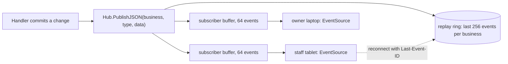

# Realtime

Kitchen screens, the floor view, a guest's split screen and the AI chat all
update without a reload. Payverge does this with **server-sent events**
(SSE) over ordinary HTTP, plus polling as a safety net. There is no
WebSocket endpoint. The decision is recorded in
[ADR 0004](../adr/0004-sse-instead-of-websockets.md).

## The business hub

[events/hub.go](../../backend/internal/events/hub.go) is an in-process
publish/subscribe hub, one per backend process.

- **Publishing.** A handler calls `PublishJSON(businessID, type, data)` after
  its transaction commits. Each event gets a sequence number per business.
  Event types are short strings such as `bill.updated`, `payment.received`,
  `order.updated` and `reservation.updated`.
- **Delivery.** Each subscriber has a 64-event buffer. A subscriber whose
  buffer is full **misses** that event rather than slowing everyone down; the
  drop is counted in metrics.
- **Replay.** The hub keeps the last 256 events per business. A client that
  reconnects with `Last-Event-ID` receives what it missed, if it is still in
  the ring.
- **Epochs.** Every process picks a random epoch at start, and event IDs look
  like `<epoch>:<seq>`. If a client presents an ID from another epoch (the
  backend restarted, or it reached a different replica) or one that has
  already left the ring, the server sends `sync.reset`, and the client
  refetches its state instead of trusting a partial replay.
- **Limits.** At most 200 open streams per business and 30 per client IP
  (`SSE_MAX_SUBSCRIBERS_PER_BUSINESS`, `SSE_MAX_SUBSCRIBERS_PER_IP`).
  Beyond that the request gets `429`.

## The staff stream

`GET /api/v1/inside/businesses/:id/events`
([sse_handler.go](../../backend/internal/events/sse_handler.go)) requires
the `overview:read` permission to connect. Then:

- **Topic scoping.** Each subscriber only receives the event types its
  permissions allow
  ([sse_permissions.go](../../backend/internal/events/sse_permissions.go)).
  A kitchen role without `financial:read` does not receive
  `payment.received`, just as it cannot read payments over REST. The RBAC
  resolver is injected from `main.go` with `events.SetPermissionResolver`,
  because `events` cannot import `server`.
- **Heartbeat.** Every 15 seconds the server sends a keepalive and re-checks
  that the staff member still has access. A revoked staff member gets a
  terminal `session_revoked` event and the stream closes.
- **Proxies.** The handler sets `X-Accel-Buffering: no`, and the HTTP server
  sets no read or write timeout (only `ReadHeaderTimeout` 15 s and
  `IdleTimeout` 120 s), so streams stay open. The Next.js proxy exempts
  `text/event-stream` responses from its 300-second timeout.

## Guest streams

Guests have no account, so their streams are keyed by an unguessable
capability and carry deliberately little data.

| Stream | Carries | Code |
|---|---|---|
| `GET /guest/table/:code/events` | Only that a bill at the table opened, changed or closed. No items, amounts or names. | [guest_table_events.go](../../backend/internal/server/guest_table_events.go), [table_hub.go](../../backend/internal/events/table_hub.go) |
| `GET /guest/bill/:bill_token/split/events` | Guest-safe split state: shares held, paid and released. | [splitting.go](../../backend/internal/handlers/splitting.go), `StreamSplitEvents` |
| `GET /ai-waiter/:businessId/stream` | AI waiter replies for one chat session. Authenticated by a bearer token held in the tab's memory, never by a cookie. | [ai_waiter_stream_handler.go](../../backend/internal/server/ai_waiter_stream_handler.go) |

Two more streams answer a single request: the director and the ops assistant
stream their answer back on the `POST …/ask/stream` request itself. An
operational alert also has its own stream
(`/businesses/:id/alerts/:alertId/events`).

## The frontend side

- [useSSEEvents.ts](../../frontend/src/hooks/useSSEEvents.ts) shares one
  `EventSource` per business between every component that listens. It
  reconnects forever with jittered exponential backoff capped at 30 seconds,
  resumes from the last event ID, and treats `sync.reset` as "refetch
  everything".
- [useGuestBillSync.ts](../../frontend/src/hooks/useGuestBillSync.ts) listens
  to a guest bill's stream and also re-reads the bill every 15 seconds, so a
  missed event costs at most 15 seconds of staleness.
- [useSSEMessages.ts](../../frontend/src/hooks/useSSEMessages.ts) reads the
  AI waiter stream with `fetch`, because `EventSource` cannot send an
  `Authorization` header.
  [useDirectorStream.ts](../../frontend/src/hooks/useDirectorStream.ts) reads
  the director's answer stream.
- About a dozen React Query hooks also poll (`refetchInterval`) for data
  that has no event, or as a fallback.

The rule for new features: **events are a hint, the REST read is the
truth.** A component should refetch on an event, not patch its state from
the event body, and should still be correct if no event ever arrives.

## Known limitations

- **Hubs live in one process.** An event published on one backend replica
  reaches only the clients connected to that replica. Postgres
  `LISTEN/NOTIFY` fan-out is not implemented. With several replicas, clients
  on the other replicas rely on polling, and a reconnect to a different
  replica triggers `sync.reset`. A single backend replica is the tested
  setup.
- **Slow clients lose events.** A full 64-event buffer drops events for that
  subscriber. Recovery relies on `Last-Event-ID` replay, `sync.reset` and
  polling.
- **Revocation takes up to 15 seconds** to close an open staff stream, the
  heartbeat interval.
- **Every open stream is an open connection.** Size proxy and file-descriptor
  limits for one connection per open dashboard tab and guest phone.
