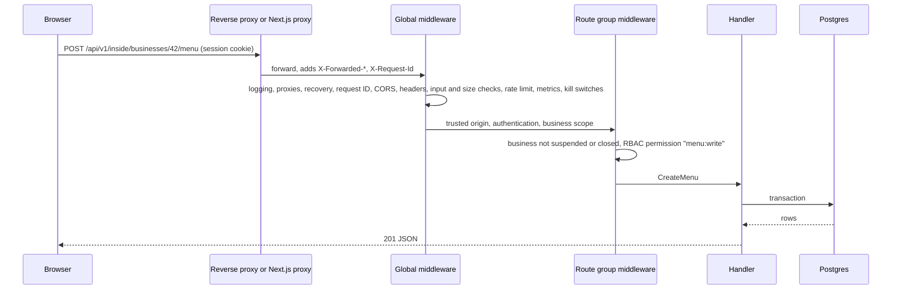

# Request flow

This page follows one authenticated request, an owner creating a menu, from
the browser to Postgres and back. Every other route uses the same pipeline
with a different route group.



## 1. Reaching the backend

The browser always calls its own origin: `/api/v1/...`. Either the reverse
proxy routes `/api/*` to the backend, or the Next.js server does it when
`BACKEND_INTERNAL_URL` is set.

The Next.js proxy
([backendProxy.ts](../../frontend/src/lib/proxy/backendProxy.ts), mounted at
[app/api/v1/[...path]/route.ts](../../frontend/src/app/api/v1/[...path]/route.ts)):

- streams request and response bodies, so uploads and server-sent events pass
  through;
- strips hop-by-hop headers, sets `X-Forwarded-For`, `-Host` and `-Proto`,
  and forwards or mints `X-Request-Id`. `X-Forwarded-For` is the connecting
  peer's address, and client-supplied client-IP headers are dropped, unless
  that peer is listed in `FRONTEND_TRUSTED_PROXIES`, in which case its chain
  is kept and the peer appended;
- refuses bodies over 15 MB with `413` and times out after 300 s with `504`
  (event streams have no timeout);
- never follows redirects, and rewrites a `Location` that points at the
  backend into a relative path.

When `BACKEND_INTERNAL_URL` is unset, the proxy answers `404`, so an edge that
routes `/api` itself is unaffected.

The Next.js middleware
([middleware.ts](../../frontend/src/middleware.ts)) resolves the guest or
operator locale and sets a per-request Content-Security-Policy nonce. It does
not authenticate anyone: every access decision is made by the backend.

## 2. Global middleware

Registered in [main.go](../../backend/cmd/app/main.go) (search
`r := gin.New()`), in this order:

| Step | Middleware | Purpose |
|---|---|---|
| 1 | `AccessLogger` | One structured line per request. |
| 2 | Trusted proxies | `TRUSTED_PROXIES` decides whose `X-Forwarded-For` is believed. Unset, it is loopback only; the bundled compose stack sets the private ranges, where Caddy and the frontend connect from. See [Known limitations](#known-limitations). |
| 3 | `gin.Recovery` | A panic becomes a `500`, not a crash. |
| 4 | Sentry | Error reporting, a no-op without a DSN. |
| 5 | `ErrorSanitizer` | Replaces every `5xx` body with a stable code and a safe message. The detail goes to the log, keyed by request ID. |
| 6 | `RequestID` | Accepts or mints `X-Request-Id` for log correlation. |
| 7 | `CORS` | Allows the `PUBLIC_URL` origin plus any `ALLOWED_ORIGINS`. |
| 8 | `SecurityHeaders` | Response hardening headers. |
| 9 | `InputValidation` | Rejects paths, query values and some headers that match common attack patterns. |
| 10 | `JSONSizeLimit` | 10 MB for JSON bodies. Multipart uploads have their own limit. |
| 11 | Global rate limit | Per client IP, `GLOBAL_RATE_LIMIT_REQUESTS_PER_MINUTE`. |
| 12 | Prometheus, flow metrics | Request counts and latency, exposed at `/metrics`. See [Metrics endpoint](#metrics-endpoint). |
| 13 | Runtime controls | Kill switches, below. |

The middleware lives in
[internal/middleware](../../backend/internal/middleware/) and
[internal/server/middleware.go](../../backend/internal/server/middleware.go).

### Runtime controls

[runtimecontrol](../../backend/internal/runtimecontrol/middleware.go) lets a
platform admin stop classes of writes without a deploy:
`maintenance_mode`, `read_only_mode`, and per-feature switches for payments,
fiscal, AI, uploads and guest orders. Reads always pass. Health checks,
webhooks and the runtime-control API itself always pass, so an operator can
switch things back on and providers can still deliver events. If the control
table cannot be read, the request is refused (`503 RUNTIME_CONTROL_DISABLED`).

### Metrics endpoint

`GET /metrics` is registered on the backend itself, outside `/api/v1`
([main.go](../../backend/cmd/app/main.go), search `metricsTokens`). Tokens
come from `METRICS_TOKENS` (comma-separated, for rotation) or `METRICS_TOKEN`.

| Mode | No token set | Token set |
|---|---|---|
| Production | The route is not registered; startup logs a warning | Requires `Authorization: Bearer <token>` |
| Development | **Open to anyone who can reach the backend** | Requires `Authorization: Bearer <token>` |

Keep the backend port private, and set a token on any instance that is not
production but is reachable from outside.

## 3. Route groups

| Prefix | Who | Group middleware |
|---|---|---|
| `/api/v1/auth` | Anyone signing in | Trusted origin for mutations; a stricter limiter on sign-in flows |
| `/api/v1/` (public) | Guests, anonymous visitors | Per-route limiters; guest routes are keyed by an unguessable table code or bill token |
| `/api/v1/staff` | Staff profile and sign-out. Staff do their work under `/inside`. | Staff token; trusted origin |
| `/api/v1/customer` | Diners with a customer account | Trusted origin; customer session (refresh and session-info stay open) |
| `/api/v1/inside` | Owners and staff in the dashboard | Trusted origin; hybrid authentication |
| `/api/v1/admin` | Platform admins | Trusted origin; admin authentication; 60 requests a minute per client IP, burst 20 |
| `/api/v1/webhooks` | Payment and messaging providers | No session. Each handler verifies its provider's signature. |

**Trusted origin**
([security.go](../../backend/internal/middleware/security.go),
`RequireTrustedOriginForMutations`) checks `Origin`, or `Referer` when
`Origin` is absent, against the CORS allow-list for every non-GET request. A
mutation with neither header is let through only when it carries no auth
cookie, as a script or server using a bearer token does. A
cookie-authenticated mutation with neither header is refused with
`403 origin_not_allowed`.

**Cookies** ([cookie.go](../../backend/internal/utils/cookie.go)) are
`HttpOnly`, `Secure` in production, and scoped to `/`. Operator session and
refresh cookies are `SameSite=Lax`, so a top-level navigation from an email
link keeps the session. Lax keeps them off cross-site `POST`s but not off
requests from a sibling subdomain of the same site; the origin check covers
that case. The diner refresh cookie `customer_refresh_token` is
`SameSite=Strict`.

**Authentication.** `HybridAuthenticationMiddleware` accepts a staff token or
a session token, from a cookie or a bearer header. Tokens are JWTs, but each
one also names a server-side session row, so signing out or revoking access
takes effect at once (`validateSession`). Authenticated responses carry
`Cache-Control: no-store`.

**Business scope.** When the URL names a business (`/businesses/:id/...`),
the same middleware loads it and refuses (`403 BIZ_NOT_OWNER`) anyone who is
not its owner, one of its staff, or a platform admin
([ownership.go](../../backend/internal/server/ownership.go)).

## 4. Per-route middleware

The menu route is registered like this:

```go
protectedRoutes.POST("/businesses/:id/menu",
    server.RequireOperationalBusiness(),
    server.RoleBasedAccessMiddleware("menu:write"),
    server.CreateMenu)
```

- **`RequireOperationalBusiness`**
  ([business_access_middleware.go](../../backend/internal/server/business_access_middleware.go))
  refuses a business the server administrator suspended
  (`403 business_suspended`) or closed (`403 business_closed`). There are no
  plans; every other business passes.
- **`RoleBasedAccessMiddleware`** calls `RequirePermissions` in
  [rbac.go](../../backend/internal/server/rbac.go). `hasPermissions` grants
  everything to a platform admin and to the business owner (matched by user
  ID, or by wallet address for wallet sign-in). Staff get their role's
  permissions plus custom grants, minus custom denies. With no business in
  scope, it denies unless the route explicitly allows user-level access.
  The response is `403 AUTH_INSUFFICIENT_ROLE` with the missing permission
  names.

Permissions are strings such as `menu:write`, `financial:read` or
`director:write`. The same resolver decides which realtime events a staff
member may receive; see [realtime.md](realtime.md).

## 5. Handler and database

[`CreateMenu`](../../backend/internal/server/business_menu_core_handlers.go)
binds the JSON body, validates it, writes through GORM in a transaction, and
returns the created rows. Handlers read the caller from the Gin context
(`user_id`, `address`, `staff_id`, `role`) rather than from the body, so a
client cannot claim to be someone else.

Errors use one envelope, `{"error": "...", "code": "..."}`, built by
`RespondWithError` in
[errors.go](../../backend/internal/server/errors.go). Money in a response is dollars as a JSON number, stored
as integer cents; see [money-flow.md](money-flow.md).

## Known limitations

- **Rate limiters are per process.** The global, auth and per-route limiters
  keep counters in memory. With several replicas, each one allows the full
  budget.
- **Proxy trust is explicit in the bundled stack.** An unset
  `TRUSTED_PROXIES` trusts loopback only. `deploy/docker-compose.yml`
  sets it, and the frontend's `FRONTEND_TRUSTED_PROXIES`, to the private
  ranges, because there only Caddy and the frontend's proxy reach the
  backend and both set `X-Forwarded-For` themselves instead of passing on
  what the client sent. If other hosts or containers on a private
  network can reach the backend port directly, they can forge client
  addresses and slip past the IP-keyed limiters. Set `TRUSTED_PROXIES` to
  the proxy's own address there. Production startup refuses public ranges
  in it, so a proxy that reaches the backend from a public address cannot
  be trusted; put it on a private network instead.
- **`/metrics` is open outside production when no token is set.** A
  staging or demo instance that is not in production mode and is reachable
  from outside exposes its metrics. Set `METRICS_TOKEN` there too.
- **Runtime controls are read on every mutating request.** They are point
  lookups on a tiny table and are not cached.
